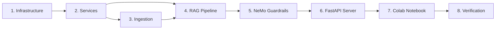

# ROADMAP.md — Mukthi Guru: Execution Strategy

> **If SPEC_DEV.md is the WHAT, this is the HOW.** This document defines the exact sequence, dependencies, and trade-offs for every execution phase. No code is written until this is locked.

---

## Execution Philosophy
- **Radical simplicity**: The simplest robust solution for each phase
- **Zero re-work**: Solve friction in markdown before it hits the compiler
- **Atomic phases**: Each phase is independently testable and commit-worthy
- **Dependency-first**: Build foundations before features

---

## Phase Map



---

## Phase 1: Infrastructure (Foundation)
**Goal**: Zero-to-runnable project skeleton

| Task | Output | Verify |
|------|--------|--------|
| Create `backend/` directory tree | All `__init__.py` files exist | `find backend -name __init__.py` |
| Write `requirements.txt` | Pinned dependencies | `pip install -r requirements.txt` succeeds |
| Write `docker-compose.yml` | Qdrant + Backend on Docker | `docker compose up -d && curl :6333/healthz` |
| Write `.env.example` + `config.py` | Pydantic Settings | `python -c "from app.config import settings"` |
| Update `.gitignore` | Python artifacts excluded | `git status` clean |

**Trade-offs considered**:
- ✅ **Local dev**: Docker Compose (Qdrant + Backend containers, Ollama on host) — chosen for reproducibility
- ✅ **Colab**: Qdrant local mode (no Docker needed) — chosen for zero-infra on Colab
- ✅ Pydantic Settings (type-safe, validation) — chosen over raw os.environ
- ❌ python-decouple — less type safety

**Risk**: None. Pure scaffolding.

---

## Phase 2: Services Layer (Building Blocks)
**Goal**: Each service works independently. No coupling between services.

| Task | Output | Verify |
|------|--------|--------|
| `qdrant_service.py` | init, upsert, search | Unit test: create collection, insert, retrieve |
| `embedding_service.py` | encode + CrossEncoder rerank | Unit test: embed text, rerank pairs |
| `ollama_service.py` | generate, classify, grade, verify | Integration test: Ollama responds |
| `ocr_service.py` | extract text from URL/file | Unit test: OCR on sample image |

**Trade-offs considered**:
- ✅ all-MiniLM-L6-v2 (80MB, CPU) — chosen for low resources
- ❌ BGE-M3 (multilingual, ~2GB model size on disk/RAM; CPU inference viable) — deferred due to resource footprint, not VRAM limitation
- ✅ CrossEncoder ms-marco (90MB, CPU) — chosen for precision
- ❌ ColBERT (multi-vector) — overkill for our corpus size
- ✅ EasyOCR (3-line API, 80+ languages) — chosen for simplicity
- ❌ PaddleOCR (faster) — harder to install on Windows

**Risk**: Ollama may not be installed. Mitigation: health check + clear error messages.

---

## Phase 3: Ingestion Pipeline (The Body)
**Goal**: YouTube URL → indexed knowledge. Image URL → indexed knowledge.

| Task | Output | Verify |
|------|--------|--------|
| `youtube_loader.py` | 3-tier transcript fallback | Test with real YouTube URL |
| `image_loader.py` | URL download + OCR | Test with sample image URL |
| `cleaner.py` | Strip filler/timestamps | Unit test with dirty transcript |
| `raptor.py` | Cluster → summarize → tree | Verify summary quality + Qdrant storage |
| `pipeline.py` | Orchestrator | E2E: URL → chunks in Qdrant |

**Trade-offs considered**:
- ✅ 3-tier transcript (manual → whisper → auto-captions) — maximum coverage
- ❌ Whisper-only — slower, unnecessary when captions exist
- ✅ RAPTOR 2-level tree (leaves + summaries) — covers specific + thematic
- ❌ RAPTOR 3+ levels — diminishing returns for our corpus size
- ✅ RecursiveCharacterTextSplitter(500, 50) — proven chunk size
- ❌ Semantic chunking — adds complexity, marginal gain

**Risk**: Whisper on CPU is slow (~2x realtime). Mitigation: Use captions first; Whisper is fallback only.

---

## Phase 4: LangGraph RAG (The Brain) — **Critical Path**
**Goal**: 11-layer pipeline produces zero-hallucination, cited answers.

| Task | Output | Verify |
|------|--------|--------|
| `states.py` | GraphState TypedDict | Type checks pass |
| `prompts.py` | All templates with guardrail instructions | Review: each prompt constrains output |
| `meditation.py` | 4-step Serene Mind | Unit test: step progression |
| `nodes.py` — intent_router | Classify DISTRESS/QUERY/CASUAL | Test: "I'm stressed" → DISTRESS |
| `nodes.py` — retrieve + rerank | Top-20 → CrossEncoder → Top-3 | Test: relevant docs scored higher |
| `nodes.py` — grade + rewrite | CRAG loop (3x max) | Test: irrelevant docs trigger rewrite |
| `nodes.py` — extract_hints | Stimulus RAG hint extraction | Test: hints contain key terms |
| `nodes.py` — generate | Answer with citations | Test: response cites sources |
| `nodes.py` — check_faithfulness | Self-RAG output check | Test: fabricated answer → rejected |
| `nodes.py` — verify_answer | CoVe verification questions | Test: subtle error → caught |
| `nodes.py` — decompose_query | Split complex queries | Test: multi-part → sub-queries |
| `graph.py` | Full LangGraph wiring | E2E: question → grounded answer |

**Trade-offs considered**:
- ✅ Stimulus RAG (1 LLM call) — chosen over fine-tuning (hours + GPU)
- ❌ Fine-tuning — higher cost, stale knowledge, hallucination risk
- ✅ CoVe (1 LLM call) — final safety net
- ❌ Full FLARE — needs token-level confidence, complex with Ollama
- ✅ Query decomposition (1 conditional LLM call) — handles "compare X and Y"
- ❌ Always decompose — adds latency for simple queries

**Risk**: Too many LLM calls → exceeds 3s latency.

**Latency Profiling Plan**:
- Sequential stages: Intent → Retrieve → Rerank → Grade → [CRAG loop ×3 max] → Hints → Generate → Faithfulness → CoVe → Guardrails
- Parallelizable: Retrieve + Rerank can overlap; Guardrails input can run concurrently with intent
- **Action**: Run early benchmarks on target hardware (Llama 3.2 on CPU/shared GPU), measure per-stage p95, update targets
- **Target**: p95 < 3s for happy path (no CRAG rewrites); p95 < 8s worst case (3× CRAG). CoVe is skippable if faithfulness passes with high confidence.

---

## Phase 5: NeMo Guardrails (Safety Layer)
**Goal**: Input blocking + output moderation

| Task | Output | Verify |
|------|--------|--------|
| `config/config.yml` | NeMo config with Ollama | Config loads without error |
| `config/topics.co` | Colang flows for blocked topics | "Bitcoin?" → blocked |
| `rails.py` | check_input, check_output | "Kill myself" → blocked + helpline |

**Trade-offs considered**:
- ✅ NeMo Guardrails (Colang DSL) — chosen for production-grade, declarative rules
- ❌ Custom Python checks — fragile, hard to maintain
- ❌ Guardrails AI (guardrails-ai) — heavier, more enterprise-focused

**Risk**: NeMo + Ollama integration may have quirks. Mitigation: Test early, fallback to custom checks if needed.

---

## Phase 6: FastAPI Server (The Interface)
**Goal**: 3 endpoints that connect frontend to backend

| Task | Output | Verify |
|------|--------|--------|
| `main.py` | CORS, 3 routes | `curl /api/health` returns ok |
| `dependencies.py` | Singleton DI | Services initialized once |
| `/api/chat` | Full pipeline | E2E: message → response |
| `/api/ingest` | Background ingestion | URL → chunks in Qdrant |
| `/api/health` | Component status | JSON with all service statuses |

**Risk**: None. Standard FastAPI patterns.

---

## Phase 7: Colab Notebook
**Goal**: One-click setup on Google Colab

| Task | Output | Verify |
|------|--------|--------|
| Cell 1: Install deps | pip install | No errors |
| Cell 2: Mount Drive | Persistence path | Drive accessible |
| Cell 3: Init Qdrant | Local mode on Drive | Collection created |
| Cell 4: Ingestion | Paste URL → process | Chunks in Qdrant |
| Cell 5: Load model | Ollama or Unsloth load | Model responds |
| Cell 6: LangGraph | All nodes | Query works |
| Cell 7: FastAPI + ngrok | Public URL | Frontend can connect |

**Risk**: Colab 12-hour limit. Mitigation: Drive persistence means no re-ingestion needed.

---

## Phase 8: Verification (Ship It)
**Goal**: Prove every SPEC_DEV.md criterion is met

| Test | Method | Expected |
|------|--------|----------|
| Hallucination rate < 1% | 20 test queries | All grounded or fallback (CRAG + Self-RAG + CoVe pipeline) |
| Response time < 3s | Benchmark 50 queries | p95 < 3s |
| Distress detection > 90% | 10 distress + 10 non-distress | ≥ 18/20 correct |
| Safety blocking | 5 harmful prompts | All blocked |
| Citation enforcement | 20 queries | All cite sources |
| Frontend E2E | Custom endpoint → chat | Messages display correctly |

---

## Dependency Graph
```
requirements.txt (no deps)
  └→ config.py (no deps)
      └→ qdrant_service.py (needs Qdrant running)
      └→ embedding_service.py (needs sentence-transformers pip)
      └→ ollama_service.py (needs Ollama running)
      └→ ocr_service.py (needs easyocr pip)
          └→ youtube_loader.py (needs yt-dlp, whisper)
          └→ image_loader.py (needs ocr_service)
          └→ cleaner.py (no deps)
          └→ raptor.py (needs embedding_service, ollama_service)
          └→ pipeline.py (needs all above)
              └→ states.py (no deps)
              └→ prompts.py (no deps)
              └→ meditation.py (no deps)
              └→ nodes.py (needs services + states + prompts)
              └→ graph.py (needs nodes)
                  └→ rails.py (needs NeMo)
                      └→ main.py (needs everything)
                          └→ AskMukthiGuru.ipynb (needs main.py)
```

---

## Timeline Estimate
| Phase | Estimated Effort | Cumulative |
|-------|-----------------|------------|
| 1. Infrastructure | 30 min | 30 min |
| 2. Services | 1 hour | 1.5 hours |
| 3. Ingestion | 1.5 hours | 3 hours |
| 4. RAG Pipeline | 2 hours | 5 hours |
| 5. Guardrails | 30 min | 5.5 hours |
| 6. FastAPI | 30 min | 6 hours |
| 7. Colab | 1 hour | 7 hours |
| 8. Verification | 1 hour | **8 hours total** |

> **3 months of engineering compressed into 1 day of high-leverage execution.**
