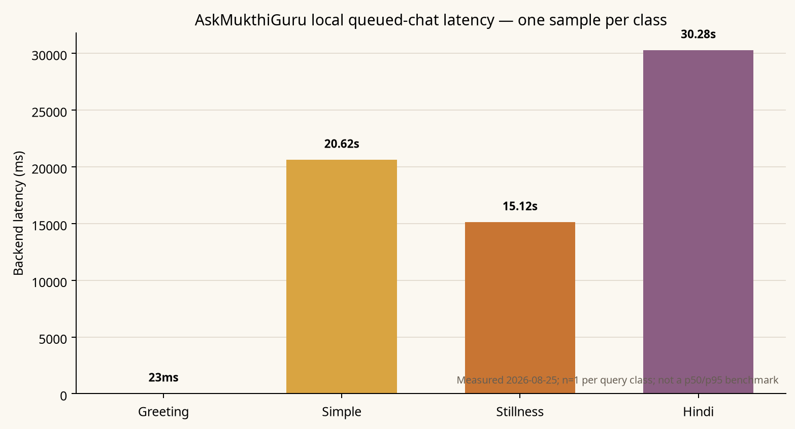

# AskMukthiGuru Ruthless End-to-End Audit

**Date:** 25 August 2026
**Author:** Manus AI
**Scope:** Attached repository and local Docker/preview runtime, product UX, chat/RAG architecture, performance, security, reliability, testing, competitors, YouTube evidence, GitHub implementation candidates, skill discovery, and traffic-analytics avenue.

## Executive verdict

AskMukthiGuru has a differentiated product thesis: a spiritual-teaching companion that combines a graph-based RAG backend, multilingual guidance, meditation/practice surfaces, provenance disclosure, safety boundaries, and anonymous access. The repository shows unusually serious work on groundedness, queueing, citations, release metadata, privacy, RLS, and safety fallbacks. The product is not yet release-ready, however, because the live local backend reports `ready=false` with a missing critical runtime artifact, the observed browser chat journey still produces an authentication error, nontrivial chat tails are measured at roughly 15–30 seconds, and the public Wisdom Map does not automatically recover when its live graph request fails.

The most important conclusion is that the product is **architecturally ambitious but operationally under-instrumented at the final user boundary**. Direct same-origin API admission and queued SSE work with a freshly issued signed token, while the attached browser still fails in a persisted-session state. This isolates the remaining chat defect to session resolution, browser state, or the UI’s post-admission handling rather than the basic backend queue or SSE contract. The release gate should remain closed until a clean anonymous browser test and an expired-session recovery test pass against a backend health payload that returns `ready=true`.

## Evidence classes

The report distinguishes evidence deliberately. **Measured** means observed from a concrete local request or test run. **Observed in product** means visible in the attached browser. **Repository evidence** means source, configuration, or test inspection. **Competitor evidence** means company-authored or independently reviewed public product information. **Inferred** means a reasoned interpretation that still needs a dedicated test. **Unknown** means not established by this audit.

## Baseline and repository integrity

The attached checkout was inspected without discarding existing work. At the start of the implementation pass, the working tree already contained modifications to `backend/docker-compose.yml` and `backend/rag/nodes/generation.py`; those changes were preserved. The current checkout is on `main` at `3d901071b7ee0f23b582266cc0104aefc44aa070`, while `origin/main` is `708ece6a9527ae8943f6706835b07062d8d50169`. No commit, reset, force-push, or remote deployment was performed during this audit.

The local services were running: `mukthiguru-backend` was healthy at the container level and `mukthiguru-frontend` was recreated successfully and reported healthy. The application health endpoint, however, returned `ready=false`, `status="unhealthy"`, and `runtime_artifacts.missing_required=["okf_compiled"]`. Qdrant, Redis, LLM, embedding, fast graph, standard graph, and queue checks were reported operational in the captured payload, but the missing required runtime artifact remains a release-blocking condition.

| Baseline area | Result | Classification | Release implication |
| --- | --- | --- | --- |
| Frontend build | 28 routes prerendered; build completed | Measured / verified | Pass |
| Frontend unit tests | 88 files passed, 1 skipped; 513 tests passed, 6 skipped | Measured / verified | Pass |
| Safe Playwright smoke + anonymous + responsive + accessibility | 34/34 passed in self-contained mode | Measured / verified | Pass for local frontend contracts |
| Docker Compose syntax | Valid | Measured / verified | Pass |
| Docker frontend image | Built and recreated successfully | Measured / verified | Pass |
| Backend health readiness | `ready=false`; missing `okf_compiled` | Measured | **P0 release blocker** |
| Repository synchronization | Local head differs from `origin/main` | Measured | Reconcile before release |

## Product walkthrough findings

The landing page communicates a clear value proposition and offers state selection, Start Chat, practices, Serene Mind, curated teachings, privacy-first language, compassionate boundaries, and crisis support. The UI also displays scale and authority claims such as “30M+ souls guided,” “#1 bestseller,” “TEDx,” and “800K+ Ekam meditators.” These were treated as product copy, not evidence of current scale or performance.

The first chat journey presents a “Before we begin” practice-consent card asking whether the seeker has completed Soul Sync or Serene Mind, followed by a visible cold-start warning that the Guru may respond slowly for the next minute. The sidebar exposes New Conversation, history, Serene Mind, Practices, Notebooks, Wisdom Map, My Reflections, incognito chat, and a journey summary. The product therefore has a strong surface-area story, but the number of visible destinations raises the cost of ensuring that every route works end-to-end.

The `/practices` route rendered five named practices with durations and themes: Wisdom Reflection, Soul Sync, Serene Mind, Beautiful State, and Daily Reflection. Favorites and links were visible. Audio playback, completion tracking, offline support, and persistence were not exercised and remain unknown. The `/notebooks` route redirected anonymous users to `/auth`, so structured learning and retention loops are not available at first value for an anonymous seeker.

The public `/knowledge-graph` route exposed search, Explore, zoom controls, reset, settings, and Show example map. Its live request failed visibly with `Couldn't load graph: Failed to fetch`; the UI did not automatically present the documented example fallback. Manually selecting Show example map did work and rendered ten concepts and eleven relationships with State, Concept, Practice, and Teacher categories. The smallest high-value product fix is to trigger that fallback automatically on a bounded fetch failure while keeping the failure state transparent.

## Chat reliability and performance

A fresh browser query entered Thinking, Searching Ekam, and Delving deep into ancient wisdom states, then ended in `ERR_UNKNOWN` / “Something went wrong” / “Failed to fetch.” After the Docker frontend was rebuilt with same-origin API routing, a cache-busted browser request still produced `AUTH_401` / “Your session expired” / “Sign in again.” The current browser had persisted authenticated/session state, so this does not prove that a clean anonymous session fails; it does prove that the product’s current browser state does not recover gracefully in this audit session.

A direct API benchmark using a freshly minted signed anonymous token showed that the backend queue was serviced successfully. The direct same-origin proxy also returned `202 Accepted` for chat admission, and a direct queued SSE probe returned authoritative `final` and `done` events. This is important: the queue and SSE contract are not generally down. The unresolved boundary is browser session state or client-side request lifecycle.

| Query class | Result | Backend latency | Interpretation |
| --- | --- | ---: | --- |
| English greeting (`Namaste`) | Completed; instant greeting; no citations | 23 ms | Fast path works |
| English simple (`What is the beautiful state?`) | Completed | 20,618 ms | Long tail is visible even for a simple query |
| Hindi query | Completed; provider/model metadata present | 30,279 ms | Multilingual path is materially slower |
| English stillness | Reflective-meaning fallback; zero citations; faithfulness 0.0; hallucination flag true; grounding abstained | 15,120 ms | Conservative quality behavior, but expensive and unsatisfying |

These are one samples per class, not a p50/p95 benchmark. They nevertheless establish that the greeting fast path and substantive tails have radically different user experiences. The visible “Guru is waking up” warning is honest, but it is not a substitute for queue position, first-token/first-status SLOs, timeout budgets, and a user-facing explanation of whether the system is retrieving, verifying, or waiting for capacity.

## Changes implemented during this audit

The following high-confidence changes were applied to the attached working tree and validated locally.

| Change | Rationale | Validation |
| --- | --- | --- |
| Docker frontend default `VITE_BACKEND_URL` changed from `http://localhost:8000` to empty, with comments documenting the Nginx `/api` proxy | The Docker frontend is served behind Nginx, so the default bundle should use same-origin `/api`; explicit staging/native overrides remain supported | Compose config passed; image built and frontend recreated; direct `/api/auth/anon-session`, `/api/chat`, and queued SSE proxy probes succeeded |
| Added `refreshAnonSessionToken()` and one-time stale-token replacement | A cached signed anonymous token can expire across reloads; the old client reused it indefinitely | Focused transport regression passed; full frontend suite passed |
| Wired one-time anonymous-token recovery into non-streaming and SSE admission | Prevents an expired anonymous token from surfacing a hard 401 before retrying with a freshly minted token | Build and full unit suite passed |
| Changed the cookie acceptance button from `!text-foreground` to `!text-primary-foreground` | The prior gold button had a verified accessibility contrast defect | 34/34 safe Playwright tests passed, including accessibility smoke |
| Normalized trailing slashes in public-route E2E assertions | Vite preview canonicalized route paths with a trailing slash; tests were asserting server formatting rather than route identity | Self-contained Playwright run passed 34/34 |
| Added a regression test for stale anonymous-token recovery | Locks in the intended 401 → mint fresh token → retry body contract | 10/10 focused transport tests passed |

No change was made to the pre-existing `backend/rag/nodes/generation.py` work or the pre-existing `backend/docker-compose.yml` schema-volume work.

## Security, safety, and observability assessment

The repository already contains several strong controls: signed anonymous-session tokens, scoped job ownership, privacy-oriented incognito behavior, provenance metadata, explicit grounding states, citation sanitization, and bounded fallback semantics. The captured health payload also reported lightweight guardrails, exact-cache health, semantic-cache health, and graph warmup status.

The remaining gap is **operational proof**. Current OWASP GenAI guidance emphasizes actionable mitigations for LLM-application risks and maps them to NIST, MITRE ATLAS, CWE, and agentic-application guidance.[1] The release plan should map prompt injection, sensitive-information exposure, supply-chain risk, unsafe tool use, authorization/data isolation, and agentic escalation to concrete tests and alert thresholds.

OpenTelemetry’s current GenAI semantic-convention work covers agent spans, events, exceptions, metrics, MCP, and provider-specific conventions.[2] AskMukthiGuru should compare its current traces against those dimensions, with particular attention to queue admission, retrieval, reranking, generation, verification, translation, fallback, and browser-visible completion. The public SSE metadata must remain an allowlisted projection; prompts, raw graph state, memory context, and safety internals must not be streamed.

Ragas defines faithfulness as factual consistency between a response and retrieved context, computed from supported claims divided by total claims.[3] The product’s existing faithfulness and grounding fields should therefore be evaluated per claim and per query class, not only as a single aggregate score. A response with zero citations and `grounding_state=abstained` should be measured as an honest abstention, while a partial source excerpt should never be presented as a verified generated teaching.

The graph pipeline should remain bounded and deterministic around safety, retrieval, verification, and provenance. LangGraph’s current documentation is useful as a reliability benchmark because it emphasizes durable execution, streaming, persistence, human-in-the-loop, memory, and observability, but the recommendation is not to add another orchestration layer blindly.[4] AskMukthiGuru already has a graph; the work is to make its boundaries observable, testable, and release-gated.

## Competitive and category research

Headspace’s public AI principles position safety, transparency, user agency, expert/clinical input, cultural responsiveness, privacy, pre-release evaluation, red teaming, post-release tracking, and LLM-as-judge evaluation as product capabilities.[5] Its Ebb product page describes a concrete loop of conversational reflection followed by personalized meditation/activity recommendations and explicit crisis and non-substitution boundaries.[6] The Figma case study further emphasizes disclosure that the user is speaking with AI, agency to exit/delete, privacy testing, discoverability, and sustained user research.[7]

Calm’s official AI article describes a bounded internal workflow: AI assists with briefs and early drafts, while humans research, edit, fact-check, and clinically review content.[8] This is a useful governance benchmark rather than evidence of a consumer spiritual chatbot. Wysa’s official positioning goes beyond chat to anonymous support, guided referral, human oversight, health-system integration, safety-by-design, and outcome reporting; its scale and efficacy numbers are company-reported and were not independently validated.[9]

An independent Wirecutter category review evaluated 29 apps, tested 19, and selected Insight Timer as the overall best experience. Its criteria included breadth, guided and unguided formats, varying lengths, personalization, favorites/playlists, navigation, free sampling, cross-device availability, and extras such as music, yoga, and journaling.[10] This makes the category gap clear: an AI chat box alone is not enough. AskMukthiGuru needs structured learning, content discovery, save/return loops, practice completion, multi-device continuity, and a trust model that explains what is and is not medical care.

| Competitor/category signal | What AskMukthiGuru should learn |
| --- | --- |
| Headspace Ebb | Make reflection lead to a concrete practice/content recommendation; expose AI identity, deletion, agency, and crisis boundaries |
| Calm | Keep generative AI bounded where editorial and clinical review matter |
| Wysa | Treat routing, human oversight, escalation, and outcome measurement as product capabilities |
| Insight Timer / category leaders | Invest in breadth, onboarding, free sampling, offline/device continuity, and content-return loops |
| AskMukthiGuru’s differentiation | Own the spiritual-teaching corpus, provenance, multilingual guidance, graph navigation, and practice-to-chat continuity—but make those advantages reliable and measurable |

## YouTube, skill discovery, GitHub, and traffic avenues

The official Headspace Ebb video was opened: [Meet Ebb: The Science-Backed AI Companion You Can Talk to About Work, Life & Everything in Between](https://www.youtube.com/watch?v=xrX_p0qDPao). The browser exposed a 1:17 player and title metadata, but no transcript/captions were available and frame-level analysis was unavailable. Accordingly, no visual or audio detail is asserted from the video; the audit uses the official product and principles pages as the substantive sources.[11]

The requested Internet Skill Finder avenue was exercised with broad and focused terms. No additional verified skill result was actionable enough to introduce into the repository during this pass. The existing RAG architecture and research workflows were sufficient for the current audit; introducing unverified external skill code would have increased risk.

The GitHub implementation search produced viable candidates, but not a reason to rewrite the system. The strongest fit signals were Ragas for evaluation, DeepEval for LLM evaluation, Langfuse for evaluation/observability/prompt management, Promptfoo for prompt/RAG red-teaming in CI, OpenLLMetry plus OpenTelemetry for GenAI traces, LangGraph or Haystack for bounded orchestration patterns, Presidio for PII detection/redaction, Qdrant for vector retrieval, and the existing stack’s direct integration points.[12] The correct adoption pattern is selective: add evaluation and observability where they close a measured gap, preserve the current deterministic graph, and reject framework sprawl.

The SimilarWeb-style collection avenue was attempted for AskMukthiGuru and benchmark domains, but current traffic and engagement responses were unavailable in this run. No rank, visit, bounce, source, country, or AI-visibility metric has been used as evidence. The next valid measurement path is first-party analytics—activation, first successful grounded answer, first completed practice, D1/D7 return, retention by language, queue abandonment, and source-panel interaction—augmented by an external traffic provider when accessible.

## Ruthless prioritization

| Priority | Finding | Why it matters | Concrete acceptance gate |
| --- | --- | --- | --- |
| **P0** | Backend health is not release-ready: `ready=false`, missing `okf_compiled` | A critical runtime artifact is absent even though several dependencies are healthy | Build/publish the artifact; `/api/health` returns `ready=true`; add CI assertion that required artifacts exist in the production image |
| **P0** | Release evidence is split across local head, origin, historical handoffs, and uncommitted work | Misaligned source/deployment state makes production claims unreliable | Reconcile branch, origin, deployed SHA, image digest, and release manifest in one signed handoff |
| **P1** | Browser chat still reaches `AUTH_401` in the attached persisted-session state | The main value proposition fails at the user boundary even when direct API/SSE works | Add a clean-storage anonymous Playwright test and an expired-auth/expired-anon test; both must produce a rendered answer or an explicit recoverable state |
| **P1** | Nontrivial chat latency is 15.12–30.28 seconds in one-sample local probes | Slow responses will cause abandonment and obscure whether retrieval or generation is at fault | Publish p50/p95 by query class with first-status, first-token, complete, and queue-wait timings; set class-specific budgets |
| **P1** | Live Wisdom Map failure requires manual fallback | Empty graph is a broken first impression of a differentiated feature | Automatically render the bounded example map after a short fetch timeout, label it as example data, and expose retry |
| **P1** | Groundedness and abstention quality are not yet held-out release gates | Conservative zero-source fallbacks are honest but can still be slow and unhelpful | Held-out benchmark by language/query class with faithfulness, citation precision/recall, abstention quality, and latency thresholds |
| **P1** | Browser-facing telemetry needs standardized GenAI dimensions | Without stage-level traces, browser failures and latency tails remain ambiguous | Emit queue, retrieval, rerank, generation, verification, translation, and fallback spans with correlation IDs and allowlisted public projections |
| **P2** | Notebooks and deeper retention loops are auth-gated | Anonymous first value lacks structured learning and return behavior | Offer a public preview or clear value sample; measure practice completion, save, return, and D1/D7 retention |
| **P2** | Tablet responsiveness is the weakest documented breakpoint | 768–1024px users may encounter layout and composer problems | Run visual and keyboard stress tests at 768, 820, 912, and 1024px |
| **P2** | Audio, Google login, forgot-password, production NDCG, and nightly RLS remain incomplete in the handoff | These are known release-readiness gaps, not theoretical enhancements | Close each item with a CI or production-safe evidence artifact before public launch |
| **P2** | Marketing scale/authority claims are unverified | Unsupported claims can erode trust and create compliance risk | Attach primary evidence, qualify claims, or remove them from public UI |

## Next sprint sequence

First, fix the health gate. Generate and package `okf_compiled` in the exact image used by the backend, fail the image build if it is missing, and make the health endpoint a deployment blocker rather than a dashboard detail.

Second, create a browser-level chat harness that starts from clean storage, mints a new anonymous token, sends a greeting and a grounded query, records request IDs and all stage timings, then repeats with an intentionally expired token. The current code now has one-time anonymous recovery, but the attached browser probe was contaminated by persisted authenticated state; the harness must prove both paths independently.

Third, instrument the queue and RAG graph with standardized GenAI spans. Measure admission, queue wait, first status, first token, retrieval, reranking, generation, verification, translation, final event, and done event. Optimize the slowest query class only after those measurements identify the actual stage.

Fourth, make the Wisdom Map failure graceful by default and add a public practice-to-chat loop: select a practice, complete it, record the completion, ask a related question, and return to a saved reflection. This is more defensible differentiation than adding another generic chat feature.

Finally, establish an evaluation release gate with held-out multilingual queries, adversarial prompt-injection cases, source-support checks, citation checks, abstention checks, and latency budgets. Use the current graph and provenance model as the foundation; adopt Ragas, Promptfoo, Langfuse/OpenTelemetry, or equivalent components only where they reduce measurement debt.

## Unknowns that must not be overstated

The audit did not establish production p50/p95 latency, retention, conversion, traffic rank, user scale, model accuracy, safety recall, cost per answer, or independent validation of competitor company-reported numbers. It did not attempt login, personal-data entry, payment, or destructive account actions. The official YouTube video was not treated as analyzed beyond title/player metadata. Audio playback, offline support, practice completion persistence, cross-device continuity, tablet stress behavior, and production Qdrant NDCG remain unverified.

## References

[1]: https://genai.owasp.org/resource/owasp-genai-llm-top-10-2026/ "OWASP GenAI / LLM Top 10 2026"
[2]: https://github.com/open-telemetry/semantic-conventions/tree/main/docs/gen-ai "OpenTelemetry GenAI semantic conventions"
[3]: https://docs.ragas.io/en/stable/concepts/metrics/available_metrics/faithfulness/ "Ragas faithfulness metric"
[4]: https://docs.langchain.com/oss/python/langgraph/overview "LangGraph overview"
[5]: https://www.headspace.com/ai "Headspace AI principles"
[6]: https://www.headspace.com/ai-mental-health-companion "Headspace Ebb AI mental health companion"
[7]: https://www.figma.com/blog/headspace-ebb-ai-companion/ "Figma case study: Headspace Ebb AI companion"
[8]: https://www.calm.com/blog/how-we-use-ai "Calm: How we use AI"
[9]: https://www.wysa.com/ "Wysa official product page"
[10]: https://www.nytimes.com/wirecutter/reviews/best-meditation-apps/ "Wirecutter: Best meditation apps"
[11]: https://www.youtube.com/watch?v=xrX_p0qDPao "Headspace: Meet Ebb video"
[12]: https://github.com/vibrantlabsai/ragas "Ragas GitHub repository"; https://github.com/confident-ai/deepeval "DeepEval GitHub repository"; https://github.com/langfuse/langfuse "Langfuse GitHub repository"; https://github.com/promptfoo/promptfoo "Promptfoo GitHub repository"; https://github.com/traceloop/openllmetry "OpenLLMetry GitHub repository"; https://github.com/langchain-ai/langgraph "LangGraph GitHub repository"; https://github.com/deepset-ai/haystack "Haystack GitHub repository"; https://github.com/data-privacy-stack/presidio "Presidio GitHub repository"

## Supporting artifacts

The attached audit workspace contains the raw evidence ledgers and machine-readable outputs used for this report: `product_observations.md`, `research_evidence.md`, `competitor_headspace.md`, `github_curated.tsv`, `similarweb_results.json`, `final_health.json`, and the latency chart `askmukthiguru_latency.png`.
