# Mukthi Guru — Backend Documentation

This directory contains the FastAPI backend, RAG pipeline (LangGraph), and ingestion services for Mukthi Guru.

## 1. High-Level Design (HLD)

### 1.1 System Context

```mermaid
graph LR
    U[👤 Seeker / Admin] --> FE[React Frontend]
    FE -->|HTTP POST /api/chat| BE[FastAPI Backend]
    FE -->|HTTP POST /api/ingest| BE
    BE --> OL[Ollama: llama3 8B]
    BE --> QD[(Qdrant Vector DB)]
    BE --> NG[NeMo Guardrails]
    BE --> WH[Whisper tiny]
    BE --> OCR[EasyOCR]
    
    style FE fill:#f9f,stroke:#333
    style BE fill:#bbf,stroke:#333
    style OL fill:#fbb,stroke:#333
    style QD fill:#bfb,stroke:#333
```



**Deployment**: Google Colab (T4 GPU, 16GB VRAM, 12GB RAM) with Drive persistence. Local HP Victus (4GB VRAM) as fallback.

---

### 1.2 Component Architecture

#### Ingestion Pipeline


**Key Design Choice — RAPTOR Hierarchical Indexing**:
Instead of flat chunk storage, we build a **2-level tree**:
- **Level 0 (Leaves)**: Raw 500-char chunks with metadata
- **Level 1 (Summaries)**: LLM-generated summaries of 5-8 related chunks

This enables both precise retrieval ("What is Ekratva?") and thematic retrieval ("What are the core teachings?") from the same index.

#### Query Pipeline (LangGraph State Machine)

```mermaid
stateDiagram-v2
    [*] --> NeMoInputRail
    NeMoInputRail --> IntentRouter: Passed
    NeMoInputRail --> SafetyResponse: Blocked

    IntentRouter --> MeditationGuide: DISTRESS
    IntentRouter --> CasualChat: CASUAL
    IntentRouter --> QueryAnalysis: QUERY

    QueryAnalysis --> Decompose: Complex
    QueryAnalysis --> Retrieve: Simple
    Decompose --> Retrieve

    Retrieve --> Rerank
    Rerank --> GradeRelevance

    GradeRelevance --> RewriteQuery: Not Relevant (retries < 3)
    GradeRelevance --> Fallback: Not Relevant (retries ≥ 3)
    GradeRelevance --> ExtractHints: Relevant

    RewriteQuery --> Retrieve

    ExtractHints --> Generate
    Generate --> FaithfulnessCheck

    FaithfulnessCheck --> ChainOfVerification: Faithful
    FaithfulnessCheck --> Fallback: Hallucinated

    ChainOfVerification --> NeMoOutputRail: Verified
    ChainOfVerification --> Fallback: Failed

    NeMoOutputRail --> FinalResponse: Passed
    NeMoOutputRail --> ModifiedResponse: Modified

    FinalResponse --> [*]
    ModifiedResponse --> [*]
    Fallback --> [*]
    SafetyResponse --> [*]
    MeditationGuide --> [*]
    CasualChat --> [*]
```



### 1.3 GraphState (Data Contract)

```python
class GraphState(TypedDict):
    question: str                   # Original user input
    sub_queries: list[str]          # Decomposed queries (if complex)
    chat_history: list[dict]        # Conversation context
    intent: str                     # DISTRESS | QUERY | CASUAL
    documents: list[dict]           # [{text, source, title, score}]
    hints: list[str]                # Stimulus RAG extracted hints
    generation: str                 # LLM answer
    citations: list[str]            # Source URLs/titles
    relevance_score: str            # yes | no
    faithfulness_score: str         # faithful | hallucinated
    verification_result: str        # verified | failed
    rewrite_count: int              # Max 3
    meditation_step: int            # 0-4
```

---

### 1.4 Technology Stack & Rationale

| Component | Tool | License | Why This One |
|-----------|------|---------|-------------|
| **LLM** | Llama 3.2 8B via Ollama | Meta Community | Best open small model for reasoning; fits T4 in 4-bit (~4.5GB) |
| **Orchestration** | LangGraph | MIT | Native support for cyclic graphs, state machines, CRAG patterns |
| **Vector DB** | Qdrant (local mode) | Apache 2.0 | Rust-based, fast, persists to disk, no Docker needed on Colab |
| **Embeddings** | all-MiniLM-L6-v2 | Apache 2.0 | 80MB, CPU-only, 384 dims, leaves GPU free for LLM |
| **Reranker** | CrossEncoder ms-marco-MiniLM-L-6-v2 | Apache 2.0 | 90MB, CPU, huge precision boost for $0 |
| **Transcription** | Whisper tiny | MIT | 39MB, CPU-friendly, sufficient for English/Hindi |
| **OCR** | EasyOCR | Apache 2.0 | 80+ languages, 3-line API, runs on CPU |
| **Guardrails** | NeMo Guardrails | Apache 2.0 | Colang flows for input/output rails, LangGraph-compatible |
| **API** | FastAPI | MIT | Async, auto-docs, Pydantic validation |
| **Tunnel** | pyngrok | MIT | Exposes Colab to frontend via HTTPS |

---

### 1.5 Scalability & Future Considerations

| Concern | Current Solution | Future Enhancement |
|---------|-----------------|-------------------|
| **More videos** | Qdrant local mode (Drive) | Qdrant Docker / cloud |
| **More languages** | EasyOCR multilingual + Bhashini mock | Full Bhashini NMT integration |
| **Higher accuracy** | 11-layer defense | GraphRAG entity extraction |
| **Production deployment** | Colab + ngrok | Docker Compose on VPS ($5/mo) |
| **Model upgrade** | llama3:8b | Qwen 2.5 7B (better multilingual) |

---

## 2. Getting Started / Walkthrough

### 2.1 Prerequisites

1.  **Docker Desktop**: Installed and running (for Docker Compose method).
2.  **Access to Ollama**:
    *   **Local**: Install [Ollama](https://ollama.com/) and run `ollama serve`. Pull the model: `ollama pull llama3.2:latest`.
    *   **Docker**: Ensure Ollama is reachable on `host.docker.internal:11434` (default in helper scripts).
3.  **Python 3.11+** (for Local method).

### 2.2 Running with Docker (Recommended)

This starts the **Backend (FastAPI)**, **Qdrant (Vector DB)**, and **Ingestion UI**.

```bash
# Navigate to backend directory
cd backend

# Start services
docker compose up -d --build

# View logs
docker compose logs -f
```

### 2.3 Running Locally (Development / Colab)

If you prefer running without Docker or are in a Colab environment:

1.  **Set up Virtual Environment**:
    ```bash
    python -m venv venv
    
    # Windows
    venv\Scripts\activate
    
    # Linux/Mac
    source venv/bin/activate
    ```

2.  **Install Dependencies**:
    ```bash
    pip install -r requirements.txt
    ```

3.  **Run Qdrant (Docker)**:
    ```bash
    # Linux / Mac (Bash)
    docker run -p 6333:6333 -p 6334:6334 \
        -v $(pwd)/qdrant_storage:/qdrant/storage \
        qdrant/qdrant:v1.13.2

    # Windows (PowerShell)
    docker run -p 6333:6333 -p 6334:6334 \
        -v ${PWD}/qdrant_storage:/qdrant/storage \
        qdrant/qdrant:v1.13.2

    # Windows (Command Prompt)
    docker run -p 6333:6333 -p 6334:6334 \
        -v %cd%/qdrant_storage:/qdrant/storage \
        qdrant/qdrant:v1.13.2
    ```

4.  **Run Backend**:
    ```bash
    # Run with uvicorn (auto-reload enabled)
    uvicorn app.main:app --host 0.0.0.0 --port 8000 --reload
    ```

### 2.4 Verification

Once running, verify the services are accessible:

*   **API Documentation (Swagger UI)**: [http://localhost:8000/docs](http://localhost:8000/docs)
    *   Test the `/api/health` endpoint to check service status.
*   **Ingestion UI**: [http://localhost:8000/ingest/](http://localhost:8000/ingest/)
    *   Simple interface to submit YouTube/Image URLs.

### 2.5 Monitoring Ingestion

During ingestion (when you submit a URL), you can monitor progress in three ways:

1.  **UI Progress Bar**: The Ingestion Portal shows a real-time progress bar and status messages.
2.  **Backend Logs**:
    *   Run `docker compose logs -f backend` to see detailed steps:
        *   `[INFO] Downloading audio...`
        *   `[INFO] Transcribing with Whisper...`
        *   `[INFO] Creating embeddings...`
        *   `[INFO] Ingestion complete!`
3.  **API Status**:
    *   Poll `GET /api/ingest/status` to get a JSON overview of active jobs:
        ```json
        {
          "https://youtu.be/...": {
            "status": "processing",
            "message": "Generating embeddings...",
            "progress": 0.75
          }
        }
        ```
