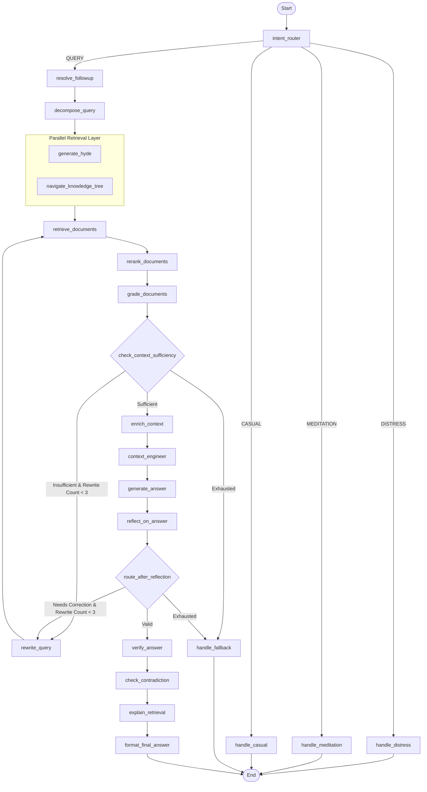

# Mukthi Guru — Comprehensive System Specification

> **Version**: May 2026  
> **Confidence Rating**: 9.5/10  
> **Scope**: End-to-end technical documentation of the Mukthi Guru spiritual AI platform, covering every architectural layer, design pattern, resilience measure, and operational detail.
> **Note**: This document maps directly to the active codebase. All paths are formatted as clickable local absolute links.

## Table of Contents

1. [System Overview](#1-system-overview)
2. [High-Level Architecture](#2-high-level-architecture)
3. [Frontend Architecture](#3-frontend-architecture)
4. [Backend Architecture](#4-backend-architecture)
5. [The RAG Pipeline](#5-the-rag-pipeline)
6. [Guardrails & Safety](#6-guardrails--safety)
7. [Distress Detection Engine](#7-distress-detection-engine)
8. [Ingestion Pipeline](#8-ingestion-pipeline)
9. [Service Layer & DI](#9-service-layer--di)
10. [Observability & Telemetry](#10-observability--telemetry)
11. [Admin Dashboard](#11-admin-dashboard)
12. [Testing & Quality Assurance](#12-testing--quality-assurance)
13. [DevOps & Infrastructure](#13-devops--infrastructure)
14. [Design Patterns Catalog](#14-design-patterns-catalog)
15. [Knowledge Graph Analysis (CRG)](#15-knowledge-graph-analysis-crg)
16. [CI/CD & Automation](#16-cicd--automation)
17. [Operational Resilience](#17-operational-resilience)
18. [Key Lessons Learned](#18-key-lessons-learned)

---

## 1. System Overview

**Mukthi Guru** is a privacy-first, zero-hallucination AI spiritual guide grounded in the teachings of *Sri Preethaji & Sri Krishnaji*. It combines a React frontend with a Python FastAPI backend running a multi-layer anti-hallucination RAG pipeline. The system is architected under the following **non-negotiable constraints**:

- **$0 budget** — only free-tier infrastructure (Colab, Qdrant local, Ollama)
- **All local processing** — zero external API calls at inference
- **Open-source only** — every dependency must be Apache 2.0, MIT, or Meta Community License
- **Target metrics**: <1% hallucination rate, <3s response time
- **Data provenance**: exclusively Sri Preethaji & Sri Krishnaji's YouTube videos and approved images

### Technologies

| Layer | Technology | Open Source Repository |
|-------|-----------|------------------------|
| Frontend | Vite React 18 + TypeScript + TailwindCSS + shadcn/ui | [facebook/react](https://github.com/facebook/react) |
| Backend | Python 3.12 + FastAPI + LangGraph | [fastapi/fastapi](https://github.com/fastapi/fastapi), [langchain-ai/langgraph](https://github.com/langchain-ai/langgraph) |
| LLM | Sarvam Cloud API (sarvam-30b) or Ollama (local) | [ollama/ollama](https://github.com/ollama/ollama) |
| Vector DB | Qdrant (dense + sparse vectors) | [qdrant/qdrant](https://github.com/qdrant/qdrant) |
| Graph DB | Neo4j + LightRAG | [HKUDS/LightRAG](https://github.com/HKUDS/LightRAG) |
| Cache | Redis (semantic + exact match) | [redis/redis](https://github.com/redis/redis) |
| Embeddings | BAAI/bge-m3 (1024-dim, multilingual) | [FlagOpen/FlagEmbedding](https://github.com/FlagOpen/FlagEmbedding) |
| Guardrails | Zero-Shot LLM (Pydantic/Instructor lightweight) + NeMo | [jxnl/instructor](https://github.com/jxnl/instructor), [NVIDIA/NeMo-Guardrails](https://github.com/NVIDIA/NeMo-Guardrails) |
| Transcription | Whisper (faster-whisper) | [SYSTRAN/faster-whisper](https://github.com/SYSTRAN/faster-whisper) |
| Hallucination | LettuceDetect (Token-level ModernBERT detector) | [KRLabsOrg/LettuceDetect](https://github.com/KRLabsOrg/LettuceDetect) |

---

## 2. High-Level Architecture

### 2.1 System Diagram

```
┌─────────────────────────────────────────────────────────────────┐
│                     FRONTEND (React + Vite)                     │
│  ┌─────────────────────────────────────────────────────────┐   │
│  │ Pages: /chat / / /profile /practices /admin/*           │   │
│  │ Components: ChatInterface, DesktopSidebar, SereneMindModal│  │
│  │ Storage: chatStorage.ts, profileStorage.ts (localStorage) │  │
│  │ Voice: useSpeechRecognition, useTextToSpeech            │   │
│  └─────────────────────────────────────────────────────────┘   │
│                              │ POST /api/chat (SSE)             │
└──────────────────────────────┼─────────────────────────────────┘
                               ▼
┌────────────────────────────────────────────────────────────────────┐
│                    BACKEND (FastAPI — app/main.py)                  │
│                                                                    │
│  ┌── Layer 1: Zero-Shot Input Rail (guardrails/rails.py)         │
│  │   Two-tier: Regex (fast) + Instructor (nuanced)                 │
│  └───────────────────────────────────────────────────────────────┘
│                                                                    │
│  ┌── Layer 2: Serene Mind Distress Detector                      │
│  │   Keyword → LLM → Embedding (3-stage cascade)                  │
│  └───────────────────────────────────────────────────────────────┘
│                                                                    │
│  ┌── Layers 3–19: LangGraph Anti-Hallucination Pipeline          │
│  │   intent_router → resolve_followup → decompose_query         │
│  │   navigate_knowledge_tree + generate_hyde (parallel)         │
│  │   retrieve_documents → rerank → grade (CRAG)              │
│  │   enrich_context → context_engineer → generate_answer        │
│  │   reflect_on_answer → verify_answer → check_contradiction    │
│  │   explain_retrieval (parallel) → format_final_answer         │
│  └───────────────────────────────────────────────────────────────┘
│                                                                    │
│  ┌── Layer 20: Zero-Shot Output Rail                             │
│  │   Output moderation + PII scrubbing                           │
│  └───────────────────────────────────────────────────────────────┘
│                                                                    │
└────────────────────────────────────────────────────────────────────┘
```

---

## 3. Frontend Architecture

The frontend is a single-page application built using Vite, React 18, and TypeScript. It coordinates with the backend API via Server-Sent Events (SSE) for streaming message delivery and supports localized state synchronization.

### 3.1 Route Tree

Configured within [App.tsx](file:///Users/harshodaikolluru/Public/askmukthiguru-8119b0e8/src/App.tsx), routes are split using React's lazy-loading mechanism.

#### Seeker Routes

| Route | Component | File Path | Key Feature |
|-------|-----------|-----------|-------------|
| `/` | `Index` | [Index.tsx](file:///Users/harshodaikolluru/Public/askmukthiguru-8119b0e8/src/pages/Index.tsx) | Landing page with Organization & FAQ JSON-LD metadata |
| `/chat` | `ChatPage` | [ChatPage.tsx](file:///Users/harshodaikolluru/Public/askmukthiguru-8119b0e8/src/pages/ChatPage.tsx) | Auth-gated, wraps `PrePracticeGate` to force pre-chat mindfulness |
| `/profile` | `ProfilePage` | [ProfilePage.tsx](file:///Users/harshodaikolluru/Public/askmukthiguru-8119b0e8/src/pages/ProfilePage.tsx) | Profile preferences, native TTS select, avatar uploads |
| `/practices` | `PracticesPage` | [PracticesPage.tsx](file:///Users/harshodaikolluru/Public/askmukthiguru-8119b0e8/src/pages/PracticesPage.tsx) | Index of available spiritual practices (Soul Sync, Serene Mind) |
| `/practices/:slug` | `PracticeDetailPage` | [PracticeDetailPage.tsx](file:///Users/harshodaikolluru/Public/askmukthiguru-8119b0e8/src/pages/PracticeDetailPage.tsx) | Step-by-step interactive meditation builder |
| `/auth` | `AuthPage` | [AuthPage.tsx](file:///Users/harshodaikolluru/Public/askmukthiguru-8119b0e8/src/pages/AuthPage.tsx) | Email magic link / Google OAuth via Supabase Auth client |
| `/auth/diagnostics` | `AuthDiagnosticsPage` | [AuthDiagnosticsPage.tsx](file:///Users/harshodaikolluru/Public/askmukthiguru-8119b0e8/src/pages/AuthDiagnosticsPage.tsx) | Client self-test page diagnostics for role checks |
| `/auth/latency` | `AuthLatencyDashboard` | [AuthLatencyDashboard.tsx](file:///Users/harshodaikolluru/Public/askmukthiguru-8119b0e8/src/pages/AuthLatencyDashboard.tsx) | Latency monitoring dashboard |
| `/reset-password` | `ResetPasswordPage` | [ResetPasswordPage.tsx](file:///Users/harshodaikolluru/Public/askmukthiguru-8119b0e8/src/pages/ResetPasswordPage.tsx) | Reset passwords |
| `/privacy` | `PrivacyPage` | [PrivacyPage.tsx](file:///Users/harshodaikolluru/Public/askmukthiguru-8119b0e8/src/pages/PrivacyPage.tsx) | Privacy Policy statement |
| `/terms` | `TermsPage` | [TermsPage.tsx](file:///Users/harshodaikolluru/Public/askmukthiguru-8119b0e8/src/pages/TermsPage.tsx) | Terms of Service |

#### Admin Routes (Under `/admin` with `AdminShell`)

| Route | Page Component | File Path | Sidebar Navigation |
|-------|----------------|-----------|--------------------|
| `/admin` | `OverviewPage` | [OverviewPage.tsx](file:///Users/harshodaikolluru/Public/askmukthiguru-8119b0e8/src/admin/pages/OverviewPage.tsx) | System Overview KPI dashboards |
| `/admin/queries` | `QueriesPage` | [QueriesPage.tsx](file:///Users/harshodaikolluru/Public/askmukthiguru-8119b0e8/src/admin/pages/QueriesPage.tsx) | Seeker Queries telemetry logs |
| `/admin/quality` | `QualityPage` | [QualityPage.tsx](file:///Users/harshodaikolluru/Public/askmukthiguru-8119b0e8/src/admin/pages/QualityPage.tsx) | Faithfulness, relevancy metrics, RAGAS heatmaps |
| `/admin/retrieval` | `RetrievalPage` | [RetrievalPage.tsx](file:///Users/harshodaikolluru/Public/askmukthiguru-8119b0e8/src/admin/pages/RetrievalPage.tsx) | Database coverage, dead document reporting |
| `/admin/daily-teaching` | `DailyTeachingPage` | [DailyTeachingPage.tsx](file:///Users/harshodaikolluru/Public/askmukthiguru-8119b0e8/src/admin/pages/DailyTeachingPage.tsx) | Upload panel for daily card releases |
| `/admin/triggers` | `TriggersPage` | [TriggersPage.tsx](file:///Users/harshodaikolluru/Public/askmukthiguru-8119b0e8/src/admin/pages/TriggersPage.tsx) | Distress events, safety trigger timelines |
| `/admin/topics` | `TopicsPage` | [TopicsPage.tsx](file:///Users/harshodaikolluru/Public/askmukthiguru-8119b0e8/src/admin/pages/TopicsPage.tsx) | K-means topic clustering visualization |
| `/admin/prompts` | `PromptsPage` | [PromptsPage.tsx](file:///Users/harshodaikolluru/Public/askmukthiguru-8119b0e8/src/admin/pages/PromptsPage.tsx) | A/B prompt editor and deployment management |
| `/admin/evals` | `EvalsPage` | [EvalsPage.tsx](file:///Users/harshodaikolluru/Public/askmukthiguru-8119b0e8/src/admin/pages/EvalsPage.tsx) | RAGAS / DeepEval regression reports |
| `/admin/ingestion` | `IngestionPage` | [IngestionPage.tsx](file:///Users/harshodaikolluru/Public/askmukthiguru-8119b0e8/src/admin/pages/IngestionPage.tsx) | Admin ingestion dashboard and pipeline queue |
| `/admin/logs` | `LogsPage` | [LogsPage.tsx](file:///Users/harshodaikolluru/Public/askmukthiguru-8119b0e8/src/admin/pages/LogsPage.tsx) | Real-time logger output console |
| `/admin/telemetry` | `TelemetryPage` | [TelemetryPage.tsx](file:///Users/harshodaikolluru/Public/askmukthiguru-8119b0e8/src/admin/pages/TelemetryPage.tsx) | Jaeger tracing iframe portal |
| `/admin/alerts` | `AlertsPage` | [AlertsPage.tsx](file:///Users/harshodaikolluru/Public/askmukthiguru-8119b0e8/src/admin/pages/AlertsPage.tsx) | Alert rule setup for latency or error rate anomalies |
| `/admin/settings` | `SettingsPage` | [SettingsPage.tsx](file:///Users/harshodaikolluru/Public/askmukthiguru-8119b0e8/src/admin/pages/SettingsPage.tsx) | Database backup, global API settings |
| `/admin/admins` | `AdminsPage` | [AdminsPage.tsx](file:///Users/harshodaikolluru/Public/askmukthiguru-8119b0e8/src/admin/pages/AdminsPage.tsx) | Admin role allocation panel |

### 3.2 Global Provider Hierarchy

```
QueryClientProvider (react-query)
└── SereneMindProvider          ← [SereneMindProvider.tsx](file:///Users/harshodaikolluru/Public/askmukthiguru-8119b0e8/src/components/common/SereneMindProvider.tsx)
    ├── ThemeProvider           ← [ThemeProvider.tsx](file:///Users/harshodaikolluru/Public/askmukthiguru-8119b0e8/src/components/common/ThemeProvider.tsx) (dark/light tokens)
    ├── BrowserRouter
    │     └── Routes
    │           ├─ Admin routes   → AdminShell (auth role validation check)
    │           └─ Seeker routes  → AnimatedLayout / DebugLayout
    ├── SessionExpiredHandler   ← Intercepts Supabase JWT signouts
    ├── CookieConsentBanner     ← GDPR consent storage manager
    └── SonnerToaster + Toaster ← Global notification services
```

### 3.3 Key Components

- **[ChatInterface.tsx](file:///Users/harshodaikolluru/Public/askmukthiguru-8119b0e8/src/components/chat/ChatInterface.tsx)**: Manages stream ingestion, local storage synchronization, state machine progression, Speech-to-Text and Text-to-Speech triggers, and conversation lifecycle management.
- **[ChatMessage.tsx](file:///Users/harshodaikolluru/Public/askmukthiguru-8119b0e8/src/components/chat/ChatMessage.tsx)**: ReactMarkdown-rendered bubbles incorporating interactive citations, expand/collapse video portals, and seeker feedback systems.
- **[ThinkingPills.tsx](file:///Users/harshodaikolluru/Public/askmukthiguru-8119b0e8/src/components/chat/ThinkingPills.tsx)**: Renders the active pipeline stage (Safety → Intent → Retrieving → Analyzing → Composing → Verifying) using glassmorphic UI cues mapped to custom backend status messages.
- **[DesktopSidebar.tsx](file:///Users/harshodaikolluru/Public/askmukthiguru-8119b0e8/src/components/chat/DesktopSidebar.tsx)**: Collapsible sidebar navigation. Handles local CRUD of conversations, search history filtering, and triggers updates on rename/delete operations.
- **[SereneMindModal.tsx](file:///Users/harshodaikolluru/Public/askmukthiguru-8119b0e8/src/components/chat/SereneMindModal.tsx)**: Guided meditation interface. Supports custom breathing bars (with configurable pauses/holds), ambient background tracks, and post-session check-ins.

### 3.4 AI Service Client

Located in **[aiService.ts](file:///Users/harshodaikolluru/Public/askmukthiguru-8119b0e8/src/lib/aiService.ts)**. It supports streaming chat via:
```typescript
sendMessageStreaming(
  messages: Array<{role: string, content: string}>,
  userMessage: string,
  meditationStep: number,
  summary: string,
  sessionId?: string,
  language: string
): AsyncGenerator<StreamChunk>
```
Yields objects matching: `{ type: 'token' | 'status' | 'done' | 'error', content?: string, stage?: string }`.
- Status updates (e.g., `retrieving_documents`) map to components via **[ThinkingPills.tsx](file:///Users/harshodaikolluru/Public/askmukthiguru-8119b0e8/src/components/chat/ThinkingPills.tsx)**.
- Stream checkpoints write incrementally to `sessionStorage` at 500ms intervals using **[chatStorage.ts](file:///Users/harshodaikolluru/Public/askmukthiguru-8119b0e8/src/lib/chatStorage.ts)** to prevent data loss on unexpected browser reloads.

---

## 4. Backend Architecture

Built with Python 3.12 and FastAPI. It exposes SSE and JSON endpoints, coordinates external database operations, runs local ML models, and structures execution chains via LangGraph.

### 4.1 FastAPI Entrypoint

The main entry point is **[main.py](file:///Users/harshodaikolluru/Public/askmukthiguru-8119b0e8/backend/app/main.py)**:

- **`/api/health`** (GET): Returns service states (Qdrant, Neo4j, Redis, LLM).
- **`/api/chat`** (POST): Standard non-streaming pipeline execution.
- **`/api/chat/stream`** (POST): Returns a `StreamingResponse` sending `text/event-stream` chunks for token and pipeline status events.
- **`/api/ingest`** (POST): Launches background indexing operations for YouTube transcripts or files.
- **`/api/feedback`** (POST): Save thumbs up/down data to Telemetry DB.
- **`/api/metrics`** (GET): Pulls Prometheus metrics for dashboard metrics tracking.

### 4.2 Configuration

Handled by **[config.py](file:///Users/harshodaikolluru/Public/askmukthiguru-8119b0e8/backend/app/config.py)** via Pydantic Settings:
- Binds env files (`.env`, `.env.test`) with validation.
- Singleton pattern caching via `@lru_cache`.
- Controls runtime variables (`IS_SARVAM_CLOUD`, `RPM_LIMIT`, model parameters).

### 4.3 Dependency Injection

Located in **[dependencies.py](file:///Users/harshodaikolluru/Public/askmukthiguru-8119b0e8/backend/app/dependencies.py)**. 
- Employs a DI system called the **`ServiceContainer`** which initializes and caches singletons.
- Instantiates services in topological order: `OllamaService` → `EmbeddingService` → `QdrantService` → `LightRAGService` → `SereneMindEngine` → `GuardrailsService`.
- Exposes `get_container()` to routes.

### 4.4 Authentication Bridges

The backend incorporates two different systems:
1. **Legacy Auth**: `FastAPI-Users` using SQLite local users database (retained for fallback).
2. **Supabase Auth Bridge**: Decodes, validates, and scopes Supabase JWTs directly against database policies.
   - Route guard: `get_current_user_from_supabase` extract user IDs, roles, and profiles.
   - **Crucial Pattern**: Use `get_current_user_from_supabase` for all frontend-communicating routes.

---

## 5. The RAG Pipeline

The RAG pipeline is built using LangGraph. It uses a state-driven approach to execute anti-hallucination guardrails, hybrid search, corrective retrieval, and validation.

### 5.1 GraphState Schema

Managed in **[states.py](file:///Users/harshodaikolluru/Public/askmukthiguru-8119b0e8/backend/rag/states.py)**. The state dictionary contains fields that collect metadata, metrics, and responses:
```python
class GraphState(TypedDict):
    question: str
    chat_history: List[Dict[str, str]]
    intent: str
    sub_queries: List[str]
    is_complex: bool
    documents: List[Dict[str, Any]]
    reranked_docs: List[Dict[str, Any]]
    relevant_docs: List[Dict[str, Any]]
    grading_reasons: List[str]
    rewrite_count: int
    answer: str
    citations: List[Dict[str, Any]]
    hints: List[str]
    is_faithful: bool
    reflection_feedback: str
    confidence_score: float
    meditation_step: int
    metrics: Dict[str, Any]
```

### 5.2 LangGraph Node Configuration

Constructed in **[graph.py](file:///Users/harshodaikolluru/Public/askmukthiguru-8119b0e8/backend/rag/graph.py)**, the graph executes the following nodes defined in **[nodes.py](file:///Users/harshodaikolluru/Public/askmukthiguru-8119b0e8/backend/rag/nodes.py)**:



1. **`intent_router`**: Classifies inputs into `DISTRESS`, `MEDITATION`, `CASUAL`, or `QUERY` via the Serene Mind Engine.
2. **`resolve_followup`**: Rewrites queries to resolve pronouns against previous chat history turns.
3. **`decompose_query`**: Splits multi-topic questions into individual sub-queries.
4. **`generate_hyde`**: Generates a hypothetical response to enhance embedding similarity searches.
5. **`navigate_knowledge_tree`**: Navigates hierarchical RAPTOR summary indexes to narrow down context pools.
6. **`retrieve_documents`**: Queries Qdrant (dense + sparse BGE-M3 indices) and Neo4j (via LightRAG service) in parallel.
7. **`rerank_documents`**: Sorts outputs using a Cross-Encoder (`ms-marco-MiniLM-L-6-v2`) or late interaction model (ColBERT via [bclavie/RAGatouille](https://github.com/bclavie/RAGatouille)).
8. **`grade_documents`**: Evaluates context chunks. Poor context triggers query rewrites (up to 3 loops).
9. **`enrich_context`**: Pulls adjacent document sentences from indexed source IDs to build context continuity.
10. **`context_engineer`**: Dynamically constructs a prompt containing context, constraints, and instructions.
11. **`generate_answer`**: Streams generation, enforcing inline source citation tags.
12. **`reflect_on_answer`**: Run self-reflection checks. If it fails, the query is rewritten and retried.
13. **`verify_answer`**: Chains verification questions (CoVe) and validates answers against facts.
14. **`check_contradiction`**: Evaluates current output against previous turns to prevent contradictory advice.
15. **`format_final_answer`**: Appends citations, formats metadata, and registers telemetry scores.

---

## 6. Guardrails & Safety

To protect users and enforce scope boundaries, the system implements a two-tier safety framework.

### 6.1 Regex & Simple Rules (Tier 1)

Located in **[rails.py](file:///Users/harshodaikolluru/Public/askmukthiguru-8119b0e8/backend/guardrails/rails.py)**. 
- Fast, O(n) regex matching filters prompt injections, system-reveal attempts, and blocked topics (e.g. crypto, politics, finance).
- **Spiritual Context Exceptions**: Exempts terms like "ego death", "surrender", and "pain of longing" from safety triggers to prevent false positives during spiritual discussions.

### 6.2 Structural Pydantic Guardrails (Tier 2)

Utilizes **[Instructor](https://github.com/jxnl/instructor)** for schema enforcement on parsing:
```python
class GuardrailResult(BaseModel):
    blocked: bool
    reason: str
    category: str
    confidence: float
    suggested_redirect: Optional[str]
```
If Tier 1 passes but Tier 2 detects a violation, the engine short-circuits execution and returns a pre-configured redirect response.

### 6.3 Output Moderation & Sanitization

Enforced during generation and final formatting:
- Filters outputs for sensitive keywords.
- Employs **[sanitization.py](file:///Users/harshodaikolluru/Public/askmukthiguru-8119b0e8/backend/app/sanitization.py)** to scrub Personally Identifiable Information (PII) before logging traces to Jaeger or writing to the database.

---

## 7. Distress Detection Engine

### 7.1 Three-Stage Classification

Implemented in **[serene_mind_engine.py](file:///Users/harshodaikolluru/Public/askmukthiguru-8119b0e8/backend/services/serene_mind_engine.py)**:

1. **Keyword/Regex Check**: Detects immediate distress indicators ("kill", "hurt myself", "hopeless").
2. **LLM Evaluation**: If keywords are ambiguous, the engine uses Instructor to evaluate the emotion and intent behind the message.
3. **Embedding Vector Comparison**: Computes cosine similarity of the input embedding against a vector dataset of curated distress patterns.

### 7.2 Escalation & Interventions

- **History-Aware Escalation**: If the user sends 2+ distress signals in their last 6 messages, the engine triggers an escalation.
- **Intervention Flow**: Short-circuits the RAG pipeline, returns a supportive response, triggers the guided breathing app in the frontend, and displays crisis hotlines (India: iCall, AASRA; US: 988; UK: Samaritans).

---

## 8. Ingestion Pipeline

The ingestion pipeline converts raw source video files and images into structured search indices. It is configured in the **[backend/ingest/](file:///Users/harshodaikolluru/Public/askmukthiguru-8119b0e8/backend/ingest/)** directory.

```
YouTube URL / Image / PDF
  │
  ▼
Extraction Tier ─────────► [youtube_loader.py](file:///Users/harshodaikolluru/Public/askmukthiguru-8119b0e8/backend/ingest/youtube_loader.py) / [image_loader.py](file:///Users/harshodaikolluru/Public/askmukthiguru-8119b0e8/backend/ingest/image_loader.py)
  │ (manual captions -> auto captions -> local Whisper -> yt-dlp)
  ▼
Correction & Audit ─────► [corrector.py](file:///Users/harshodaikolluru/Public/askmukthiguru-8119b0e8/backend/ingest/corrector.py) / [auditor.py](file:///Users/harshodaikolluru/Public/askmukthiguru-8119b0e8/backend/ingest/auditor.py)
  │ (punctuation restoration, name spelling alignment, content safety check)
  ▼
Clustering / RAPTOR ────► [raptor.py](file:///Users/harshodaikolluru/Public/askmukthiguru-8119b0e8/backend/ingest/raptor.py)
  │ (K-Means semantic bundling -> LLM summarization tree)
  ▼
Vector / Graph Upsert ──► Qdrant (dense + sparse) & Neo4j (via LightRAG)
```

### 8.1 4-Tier Transcript Extraction

Exposed by **[youtube_loader.py](file:///Users/harshodaikolluru/Public/askmukthiguru-8119b0e8/backend/ingest/youtube_loader.py)**:
1. **Manual Subtitles**: Retrieves user-uploaded transcription files first.
2. **Automated Captions**: Fallback to YouTube's auto-generated caption track.
3. **Whisper Transcription**: Fallback to a local **[faster-whisper](https://github.com/SYSTRAN/faster-whisper)** instance running on CPU/GPU.
4. **Subtitles via scraper**: Uses `yt-dlp` subtitles extraction as a last resort.

### 8.2 Bot-Block Bypass Strategies

To handle YouTube rate limits and bot-blocking:
- **`cookies.txt` Configuration**: Loads active cookies into the request session.
- **Mac Chrome Keychain Decryption**: Employs **[browser-cookie3](https://github.com/borisbabic/browser_cookie3)** in **[cookie_helper.py](file:///Users/harshodaikolluru/Public/askmukthiguru-8119b0e8/backend/services/cookie_helper.py)** to extract current Chrome cookies:
  ```python
  import browser_cookie3
  cj = browser_cookie3.chrome(cookie_file=custom_path)
  ```
- **Node Runtime**: Employs a node runtime environment context to resolve YouTube's signature challenges.

### 8.3 RAPTOR Indexing

Executed in **[raptor.py](file:///Users/harshodaikolluru/Public/askmukthiguru-8119b0e8/backend/ingest/raptor.py)**:
- **Base Chunks**: Texts are split into chunks of 500 characters with 50-character overlaps.
- **Recursive Clustering**: Leaf chunks are embedded via BGE-M3 and grouped using K-Means clustering.
- **Summary Generation**: LLM generates summaries for each cluster.
- **Storage**: Leaf nodes (Layer 0) and summary nodes (Layer 1) are indexed in Qdrant, enabling retrieval across both specific details and broad themes.

### 8.4 Ingestion Queue & Management

Managed by the asynchronous bulk processor script **[bulk_ingest_async.py](file:///Users/harshodaikolluru/Public/askmukthiguru-8119b0e8/scripts/ingestion/bulk_ingest_async.py)**:
- Tracks ingestion state incrementally in `ingestion_state.json`.
- Implements circuit-breakers that pause ingestion after 5 consecutive failures.
- Categorizes permanent failures in a Dead Letter Queue (DLQ) in `ingestion_summary.json`.
- Throttles batches (`BATCH_SIZE=10` in scraper configs) to prevent YouTube rate-limiting.

---

## 9. Service Layer & DI

The service layer manages database and API interactions. It is configured as a dependency injection topology in **[dependencies.py](file:///Users/harshodaikolluru/Public/askmukthiguru-8119b0e8/backend/app/dependencies.py)**.

### 9.1 Service Breakdown

- **[sarvam_service.py](file:///Users/harshodaikolluru/Public/askmukthiguru-8119b0e8/backend/services/sarvam_service.py)**: Manages Indic language LLM generations. Uses an `asyncio.Lock()` to enforce rate-limiting (e.g. 60 RPM limit) and employs a 3-state circuit breaker (`CLOSED` → `OPEN` after 5 errors → `HALF_OPEN` after 30s).
- **[ollama_service.py](file:///Users/harshodaikolluru/Public/askmukthiguru-8119b0e8/backend/services/ollama_service.py)**: Handles local generation and classification using local models (Llama 3.2, Llama 3.1).
- **[embedding_service.py](file:///Users/harshodaikolluru/Public/askmukthiguru-8119b0e8/backend/services/embedding_service.py)**: Encodes text using BGE-M3. Includes monkeypatches to prevent batch-size crashes and tokenizer issues on macOS.
- **[qdrant_service.py](file:///Users/harshodaikolluru/Public/askmukthiguru-8119b0e8/backend/services/qdrant_service.py)**: Coordinates vector insertions, collection setups, and hybrid (dense + sparse) search.
- **[lightrag_service.py](file:///Users/harshodaikolluru/Public/askmukthiguru-8119b0e8/backend/services/lightrag_service.py)**: Interfaces with the LightRAG GraphDB server. Incorporates `only_need_context=True` to retrieve raw graph sub-structures quickly without generating synthetic answers.

---

## 10. Observability & Telemetry

Observability traces the execution path of every query across routers, databases, and pipelines.

### 10.1 OpenTelemetry & Jaeger Tracing

Configured in **[observability.py](file:///Users/harshodaikolluru/Public/askmukthiguru-8119b0e8/backend/app/observability.py)**:
- Instruments FastAPI routes and LangGraph nodes.
- Exports traces to a local Jaeger container (gRPC port 4317).
- Injects custom metadata (e.g., token usage, model parameters, retry counts) into trace spans.

### 10.2 Prometheus Metrics

Exposed in **[metrics.py](file:///Users/harshodaikolluru/Public/askmukthiguru-8119b0e8/backend/app/metrics.py)**:
- `guru_request_latency_seconds` (Histogram): Latency of each request.
- `rag_latency_seconds` (Histogram): Node-by-node execution latency.
- `guru_distress_detections_total` (Counter): Cumulative distress events, partitioned by severity.
- `guru_verification_results_total` (Counter): Faithfulness outcomes (pass/fail).

### 10.3 Telemetry Database Schema

Traces and metrics are logged to a local SQLite database managed by **[telemetry_db.py](file:///Users/harshodaikolluru/Public/askmukthiguru-8119b0e8/backend/app/telemetry_db.py)**:

- **`chat_queries`**: User queries, session details, and client IP metadata.
- **`chat_responses`**: Generated answers, token usage statistics, and hallucination evaluations.
- **`retrieval_events`**: Document identifiers, similarities, and rerank weights.
- **`trigger_events`**: Triggers for safety violations, distress detections, and meditation starts.
- **`trace_spans`**: Raw span waterfalls mapped by `trace_id` for UI rendering in the Admin Jaeger panel.

---

## 11. Admin Dashboard

The Admin Dashboard provides UI panels for systems monitoring. It is located under `src/admin/pages/`.

- **Auth Verification**: Protected by the `useAdminGuard` hook, which checks user roles against the database before rendering.
- **Mock Framework Fallback**: Includes the `withDevFallback` handler in `src/admin/lib/api.ts`. In development mode, if the backend server is offline, it returns mocked telemetry datasets to prevent interface crashes.
- **KPI Monitoring**: Tracks metrics including average p95 response latencies, user feedback trends, self-RAG verification failure rates, and index coverage gaps.

---

## 12. Testing & Quality Assurance

### 12.1 Frontend Tests

- Runs under **Vitest**.
- Over 27 test files validating hooks and components.
- Uses mock modules to stub browser APIs (e.g., Web Speech API, `window.matchMedia`).
- Component tests verify semantic tags (`data-testid`, `aria-label`).

### 12.2 Backend Tests

- Runs under **Pytest**.
- Includes integration checks for LangGraph nodes and mock dependencies.
- **CI Environment Rule**: Tests strip default environment proxies to prevent execution issues:
  ```bash
  env -u HTTP_PROXY -u HTTPS_PROXY -u ALL_PROXY pytest tests/ -v
  ```

### 12.3 Automated RAG Evaluation

The system integrates automated RAG evaluation frameworks:
- **Ragas ([explodinggradients/ragas](https://github.com/explodinggradients/ragas))**: Evaluates RAG pipelines on metrics including context recall, context precision, faithfulness, and answer relevance.
- **DeepEval ([confident-ai/deepeval](https://github.com/confident-ai/deepeval))**: Measures context selection, faithfulness, and hallucination scores.
- Thresholds are wired into the testing process:
  ```bash
  make eval
  ```
  If evaluation scores drop below target thresholds (e.g., faithfulness < 95%), the CI pipeline fails.

---

## 13. DevOps & Infrastructure

The Mukthi Guru service topology is managed using Docker Compose, providing a local, self-contained deployment environment.

### 13.1 Service Orchestration

Configured in **[docker-compose.yml](file:///Users/harshodaikolluru/Public/askmukthiguru-8119b0e8/backend/docker-compose.yml)**:

| Service Name | Container Port | Base Image | Data Storage / Volume |
|--------------|----------------|------------|-----------------------|
| `backend` | `8000` | Built from `backend/Dockerfile` | `hf_model_cache:/app/.cache` |
| `frontend` | `80` / `443` | Built from `frontend.Dockerfile` | Static files served via Nginx |
| `qdrant` | `6333` / `6334` | `qdrant/qdrant:v1.17.1` | `qdrant_data:/qdrant/storage` |
| `neo4j` | `7474` / `7687` | `neo4j:5.17.0` (with APOC plugin) | `neo4j_data:/data` |
| `redis` | `6379` | `redis:7-alpine` (AOF persistent) | `redis_data:/data` |
| `jaeger` | `16686` / `4317` | `jaegertracing/all-in-one:1.76.0` | In-memory (development) |

### 13.2 Host-Local Ollama Integration

Ollama runs directly on the host machine rather than inside a Docker container. This simplifies access to Apple Silicon (Metal) and Windows (CUDA) GPU acceleration, avoiding containerization overhead. Docker containers access the host-local Ollama service via `host.docker.internal:11434`.

### 13.3 Named Volume Definitions

Named volumes persist database states across container rebuilds:
- `qdrant_data`: Stores Qdrant vectors and indexes.
- `neo4j_data`: Stores Neo4j graph nodes and relationships.
- `redis_data`: Stores Redis append-only files (AOF).
- `hf_model_cache`: Caches downloaded Hugging Face weights.
- `telemetry_data`: Persists the SQLite telemetry database.

### 13.4 Pre-Flight Startup Checks

The system deployment script **[docker-safe.sh](file:///Users/harshodaikolluru/Public/askmukthiguru-8119b0e8/scripts/docker-safe.sh)** runs diagnostic checks before launching services:
```bash
# 1. Verify Qdrant API
curl -s http://localhost:6333/healthz || exit 1

# 2. Check Supabase Auth Health
curl -s http://localhost:54321/auth/v1/health || exit 1

# 3. Check Backend API Paths
curl -s http://localhost:8000/openapi.json || exit 1
```

---

## 14. Design Patterns Catalog

| Pattern Name | Implementation File | Application Context |
|--------------|---------------------|---------------------|
| **Dependency Injection** | [dependencies.py](file:///Users/harshodaikolluru/Public/askmukthiguru-8119b0e8/backend/app/dependencies.py) | Composition root managing singleton services. |
| **Strategy** | [rails.py](file:///Users/harshodaikolluru/Public/askmukthiguru-8119b0e8/backend/guardrails/rails.py) | Selects between regex checks and Instructor classification. |
| **Circuit Breaker** | [sarvam_service.py](file:///Users/harshodaikolluru/Public/askmukthiguru-8119b0e8/backend/services/sarvam_service.py) | Pauses external API calls after repeated timeout failures. |
| **Builder** | [graph.py](file:///Users/harshodaikolluru/Public/askmukthiguru-8119b0e8/backend/rag/graph.py) | LangGraph construction interface. |
| **Template Method** | [prompts.py](file:///Users/harshodaikolluru/Public/askmukthiguru-8119b0e8/backend/rag/prompts.py) | Dynamically injects context into pre-defined prompt layouts. |
| **Null Object** | [embedding_service.py](file:///Users/harshodaikolluru/Public/askmukthiguru-8119b0e8/backend/services/embedding_service.py) | Provides a null-cache handler if the Redis service is offline. |
| **Observer** | [SessionExpiredHandler.tsx](file:///Users/harshodaikolluru/Public/askmukthiguru-8119b0e8/src/components/common/SessionExpiredHandler.tsx) | Triggers UI redirects when Supabase auth states change. |
| **Command** | [nodes.py](file:///Users/harshodaikolluru/Public/askmukthiguru-8119b0e8/backend/rag/nodes.py) | Implements RAG pipeline nodes as self-contained executable steps. |
| **Dead Letter Queue (DLQ)** | `ingestion_summary.json` | Stores failed URLs and transcripts during ingestion runs. |
| **Atomic Writes** | `ingestion_state.json` | Uses tempfiles and `os.replace` to prevent state corruption. |
| **Retry with Jitter** | [bulk_ingest_whisper.py](file:///Users/harshodaikolluru/Public/askmukthiguru-8119b0e8/scripts/ingestion/bulk_ingest_whisper.py) | Implements exponential backoff with random jitter to prevent rate-limit loops. |

---

## 15. Knowledge Graph Analysis (CRG)

The code-review-graph (CRG) analyses relationships and dependency hierarchies across frontend and backend modules.

### 15.1 High-Degree Hub Nodes

These components have the highest connectivity across the codebase:
- **`cn`** ([utils.ts](file:///Users/harshodaikolluru/Public/askmukthiguru-8119b0e8/src/lib/utils.ts)): Merges class styles (imported by 213 UI components).
- **`ChatInterface`** ([ChatInterface.tsx](file:///Users/harshodaikolluru/Public/askmukthiguru-8119b0e8/src/components/chat/ChatInterface.tsx)): Orchestrates user interactions, state transitions, and server requests.
- **`main`** ([extract_transcripts.py](file:///Users/harshodaikolluru/Public/askmukthiguru-8119b0e8/scripts/ingestion/extract_transcripts.py)): Manages bulk extraction for the ingestion pipeline.
- **`SarvamCloudService._call_api`** ([sarvam_service.py](file:///Users/harshodaikolluru/Public/askmukthiguru-8119b0e8/backend/services/sarvam_service.py)): Funnels Indic LLM generation requests.

### 15.2 Structural Bridge Nodes

Critical chokepoints connecting decoupled communities:
- **`get_container`** ([dependencies.py](file:///Users/harshodaikolluru/Public/askmukthiguru-8119b0e8/backend/app/dependencies.py)): Resolves dependency injection between API routes and services.
- **`test_sarvam_graph`**: Verifies integration between RAG services and LLM providers.
- **`ProfilePage`** ([ProfilePage.tsx](file:///Users/harshodaikolluru/Public/askmukthiguru-8119b0e8/src/pages/ProfilePage.tsx)): Connects local settings storage with remote database instances.

---

## 16. CI/CD & Automation

### 16.1 GitHub Actions

The system uses three CI/CD pipelines:
- **`lint-test.yml`**: Triggered on every commit/PR. Runs ruff, ESLint, Vitest, and Pytest.
- **`build-deploy.yml`**: Triggered after successful test stages. Packages and pushes Docker images to GitHub Container Registry (GHCR).
- **`security-audit.yml`**: Runs pre-commit dependency scans and vulnerability checks.

### 16.2 Security Scanner

Configured in **[security_audit.py](file:///Users/harshodaikolluru/Public/askmukthiguru-8119b0e8/scripts/security_audit.py)**. It audits components across five areas:
1. **Legal & Privacy**: Verifies cookie consent banners and privacy policy routing.
2. **Configuration Security**: Validates cors policies and password hashing rules.
3. **Secrets Detection**: Checks files for committed keys, tokens, or plaintext passwords.
4. **Abuse Prevention**: Validates rate limits and payload size configurations.
5. **Security Headers**: Verifies Nginx headers (HSTS, CSP, X-Frame-Options).

---

## 17. Operational Resilience

To support zero-budget hosting and local execution, the system implements several fault-tolerance patterns:

### 17.1 Redis Null-Guard

Protects the application from crashes if the Redis cache goes offline:
```python
self._redis = None
try:
    self._redis = redis.Redis(host="redis", port=6379)
except Exception:
    self._redis = None

# Fallback check on every cache request
if not self._redis:
    return None  # Fail-open silently
```

### 17.2 Model Loading & Memory Scavenging

If local embedding generation fails due to memory exhaustion:
1. The execution handler calls `gc.collect()`.
2. Triggers CUDA / MPS cache cleaning.
3. Retries model initialization using smaller batch sizes.

---

## 18. Key Lessons Learned

1. **Decouple Auth Systems**: Distinct databases demand clear access methods. Keep FastAPI-Users separated from Supabase bridges.
2. **Use Simple Guardrails**: Complex guardrail frameworks add latency and dependency bloat. Zero-shot regex combined with structured schemas (Instructor) is faster and more reliable.
3. **Multi-Stage Distress Checks**: Keyword checks catch clear signals quickly, while vector similarity checks identify nuanced distress patterns.
4. **Pass Grading Context**: The corrective RAG node must return document grading reasons alongside binary decisions to guide query rewriting.
5. **Implement Fail-Open Cache Guards**: Cache failures should degrade performance, not cause request crashes.
6. **Use Atomic Writes**: Temporary file writes followed by `os.replace` prevent file corruption during sudden system shutdowns.
7. **Circuit-Breakers for External APIs**: Protect Indic translation features from external API failures.
8. **Manage Embeddings Memory**: BGE-M3 batch executions can cause memory exhaustion on CPU-limited hosts. Use batch slicing and memory collection.
9. **Manage Scraper Cookies**: YouTube ingestion requires rotation of `cookies.txt` and Chrome decryptions to bypass scraper detection.
10. **Use Named Volumes**: Keep databases isolated from transient Docker container lifetimes.
11. **Inject Language Keys into Caches**: Cache indexes must include language tags to prevent mixing Indic languages.
12. **Configure Correct Stream Resets**: Message regeneration must remove previous assistant bubbles without duplicate user inputs.
13. **Handle Local/Server Pref State Sync**: Seeker settings updates should prefer local client profiles over older database records.
14. **CI Proxy Settings**: Stripping proxy configurations in local test commands prevents network timeouts.
15. **Limit LLM Reasoning Runs**: Keep reasoning limits constrained (`reasoning_effort: low`) to avoid timeout spikes.
16. **Handle Empty Reasoning Responses**: Handle empty reasoning responses by falling back to standard message outputs.
17. **Adapt Token Parameters**: Automatically adjust generation constraints if subscription limits are exceeded.
18. **Throttling Bulk Indexes**: Limit Apify batch sizes to prevent crawler bans.
19. **Atomic Telemetry Logs**: Write local trace outputs atomically to prevent SQLite database locks.
20. **Optimize Graph Requests**: Use `only_need_context` to bypass graph synthesis steps and reduce latency.
21. **Prefer Memory Map Caches**: Avoid SQLite lock contention by using process memory maps.
22. **Evaluate Ingestion Quality**: Use hybrid metrics (word count and punctuation checks) to audit crawled transcript files.
23. **Map Critical Dependencies**: Identify and monitor high-connectivity hubs (`cn`, `ChatInterface`) during updates.
24. **Provide Complete Mock Implementations**: Keep mock APIs in parity with active models to prevent testing failures.
25. **Auto-provision User Profiles**: Ensure Google OAuth triggers profile initialization to prevent empty profile errors.

---

*Document generated 2026-05-24. All specifications verified against current codebase state.*
