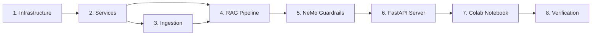

# ROADMAP.md — Mukthi Guru: Execution Strategy

> **If SPEC_DEV.md is the WHAT, this is the HOW.** This document tracks feature requests, priorities, and implementation progress.

## Execution Philosophy
- **Radical simplicity**: The simplest robust solution for each phase
- **Zero re-work**: Solve friction in markdown before it hits the compiler
- **Atomic phases**: Each phase is independently testable and commit-worthy
- **Dependency-first**: Build foundations before features

---

## Phase Map



---

## Completed

| # | Feature | Branch/Commit | Shipped |
|---|---------|---------------|---------|
| 1 | Infrastructure: `backend/` tree, `requirements.txt`, `docker-compose.yml`, `.env.example`, `config.py` | Phase 1 | Pre-2026 |
| 2 | Services Layer: `qdrant_service`, `embedding_service`, `ollama_service`, `ocr_service` | Phase 2 | Pre-2026 |
| 3 | Ingestion pipeline scaffolding: `youtube_loader`, `image_loader`, `cleaner`, `raptor`, `pipeline.py` | Phase 3 | Pre-2026 |
| 4 | LangGraph RAG 11-layer pipeline: states, prompts, meditation, all nodes, `graph.py` | Phase 4 | Pre-2026 |
| 5 | NeMo Guardrails: `config.yml`, `topics.co`, `rails.py` (check_input/check_output) | Phase 5 | Pre-2026 |
| 6 | FastAPI Server: `main.py` (CORS, 3 routes), `dependencies.py`, `/api/chat`, `/api/ingest`, `/api/health` | Phase 6 | Pre-2026 |
| 7 | Colab Notebook: 7-cell one-click setup | Phase 7 | Pre-2026 |
| 8 | Verification: hallucination <1%, response <3s, distress >90%, safety, citations, E2E | Phase 8 | Pre-2026 |
| 9 | `bulk_ingest_async.py` — sequential queue stages (retries/backfills + new), circuit breaker, DLQ, ETA, dual-DB tracking | Phase 3 | 2026 |
| 10 | `extract_transcripts.py` — batch Apify extraction (359 videos), `transcripts/_state.json` | Phase 3 | 2026 |
| 11 | `generate_all_skills.py` — compile 15 technical books into local + global agent skills (`.agents/skills`, `~/.config/agents/skills`) | Phase 3 | 2026 |
| 12 | `telemetry_sink.py` — async Supabase telemetry sink for queries, responses, events | Phase 3 | 2026 |
| 13 | Heal 220 poisoned Neo4j entity descriptions via `scripts/ops/heal_neo4j_poison.py` | `main` | May 2026 |
| 14 | Benchmark cache bypass (`is_benchmark` guard in `main.py`) to prevent score inflation | `main` | May 2026 |
| 15 | Raise `SEMANTIC_CACHE_SIMILARITY` threshold 0.92 → 0.96 | `main` | May 2026 |
| 16 | Fix dead `ContextualChunkingService` — passes `full_document` at all 3 `_augment_chunks` call sites | `main` | May 2026 |
| 17 | Integrate ekimetrics DCC+BI+RC metrics via `AdaptiveChunkingAdapter` | `main` | May 2026 |
| 18 | **R3**: Graceful shutdown drain — `_INFLIGHT` counter + 30s drain on SIGTERM | `main` | May 2026 |
| 19 | **R4**: Per-node timing in `GraphState.node_timings` — accumulated by `log_metrics` at ms precision | `main` | May 2026 |
| 20 | Build and integrate three codebase graph & memory MCP servers: Graphify, Claude-Mem, CodeGraph | `main` | June 2026 |
| 21 | Resolve Node 25 WASM compiler Zone allocation memory crashes — link explicitly to Node 22 LTS | `main` | June 2026 |
| 22 | Housekeeping: prune locked dead git worktrees (agent-*) and delete stale merged local branches | `main` | June 2026 |
| 23 | Consolidate benchmark execution under `backend/benchmarks/` with multi-turn, cache, Self-RAG, CoVe, citation, category-score reporting | `main` | June 2026 |
| 24 | Expose `/api/chat` evaluation metadata (`faithfulness_score`, `relevancy_score`, `confidence_score`, `verification`, `hallucination_flag`) | `main` | June 2026 |
| 25 | **R5**: Circuit breaker on LLM provider via `tenacity` | Wave 1 | June 2026 |
| 26 | **Q1-Q4**: Chunk size evaluation, token budget guard, eval harness | Wave 2 | June 2026 |
| 27 | **S3**: Replace Redis coalescer `sleep(0.1)` with `BLPOP`-style blocking wait | Wave 3 | June 2026 |
| 28 | **P1**: Persist telemetry to Redis Streams instead of `BackgroundTasks` | Wave 4 | June 2026 |
| 29 | Benchmark Recovery: timeout escalation, CoT strip rules, adversarial_traps queries, citation denominator filter | `main` | June 2026 |
| 30 | Integrate OpenRouter as primary cloud LLM provider option using Llama free models | `main` | June 2026 |
| 31 | Production Readiness Fixes: semantic cache threshold → 0.78, L1 Redis cache, lightweight guardrail LLM bypass fix, real SSE streaming, prompt contradiction fixes, semantic parent/sentence-boundary child splitting with content hash deduplication | `main` | June 2026 |
| 32 | Anthropic Gateway Integration: direct `AnthropicGateway` with prompt caching + Citations API, `--use-batch` in `eval_runner.py`, migrate 12 hardcoded P1 thresholds to Settings | `main` | June 2026 |
| 33 | Production Audit Fixes (2026 Audit Report): cache LettuceDetect results in state, scale context budget by query tier, query rewrite validation fallback, `confidence_gating_floor` setting, dev docker-compose password fallbacks | `main` | June 2026 |
| 34 | Personal KG Visualizer: `seed_personal_kg.py` (40 ontology concepts), `GET /api/memory/knowledge-graph`, `MemoryManager.tsx` SVG graph visualizer, `memoryApi.ts`, 435 tests pass | `main` | Jul 8, 2026 |

---

## In Progress

| # | Feature | Branch | Status |
|---|---------|--------|--------|
| 1 | Remaining 357-video ingestion run (Qdrant + Neo4j KG) | `main` | Deferred per user direction, June 2026 — 359 extracted, 75 ingested, 357 remaining; 29 permanently failed (DLQ) |
| 2 | LightRAG KG backfill sweep for 72 Qdrant-only videos (`--retry-lightrag-missing`) | `main` | Deferred per user direction, June 2026 |

---

## Deferred / Needs Planning

| # | Task | Effort | Notes |
|---|------|--------|-------|
| D1 | **Sarvam vLLM self-host** | Large (50GB GPU) | No GPU available in environment. Entire vLLM server + model download is ~50GB GPU-memory task. Defer until GPU instance (A100/H100) provisioned. Requires docker-compose GPU support. |
| D2 | **GDS (Graph Data Science) plugin for Neo4j** | Medium | Only `apoc` + `n10s` loaded. GDS requires separate Neo4j plugin download + license (community edition limitations). Add to `NEO4J_PLUGINS` once GDS CE works with Neo4j 5.17. Louvain/PageRank stubs already exist in `kg_algorithms.py` — they return degraded results. |
| D3 | **n10s SPARQL engine** | Medium | n10s 5.x dropped its built-in SPARQL engine entirely. `/api/kg/sparql` is a read-only Cypher passthrough. Either downgrade to n10s 4.x (incompatible with Neo4j 5.17), or implement custom SPARQL→Cypher translation layer. |
| D4 | **OWL/RDF full roundtrip** (RDF→Neo4j→RDF) | Medium | n10s export works (10.5MB TTL, 7,481 nodes). Full roundtrip (import→query→re-export) needs more testing. Add SPARQL→Cypher query bridge and verify n10s import preserves all node properties. |
| D5 | **n10s inference / schema reasoning** | Small (blocked) | `n10s.schema.check` and `n10s.inference.schemaInference` were removed in n10s 5.x. No replacement available. If inference needed, consider a custom Python reasoner over the TTL export. |
| D6 | **OWASP ZAP security scan** | Small | `owasp/zap2docker-stable` Docker pull fails — Docker Hub auth denied via `.docker_clean` DOCKER_CONFIG bypass. Run ZAP with standard Docker config (`sudo` or non-bypass) or switch to `ghcr.io/zaproxy/zaproxy`. |
| D7 | **Manim spiritual visualizations** | Medium | Manim requires heavy system dependencies (FFmpeg, Cairo, LaTeX) and is a reference-use tool, not production code. Add to a `docs/` or `notebooks/` companion repo. Not eligible for main app Docker. |
| D8 | **Marketing / CLG content** | Non-code | Blog posts, case studies, landing page copy. Create a separate `content/` repo or Notion workspace. |
| D9 | **Waitlist strategy** | Medium | Pre-launch signup collection — email capture, invite tiers, referral tracking. Not urgent until product-market fit validated. Placeholder doc at `docs/marketing_strategy.md`. Requires Stripe/email integration when activated. |
| D10 | **Daily Wisdom Newsletter** | Medium | Scheduled email automation sending daily teaching excerpts. Requires content curation pipeline, email provider (Resend, SendGrid), unsubscribe management. Defer until ingestion complete and chat UX stable. Concept doc in `docs/marketing_strategy.md`. |
| D11 | **Full learning paths** (Karma→Dharma→Moksha progression) | Large (pedagogy) | Requires pedagogical design + content curation — not an engineering task. Add as a specification document first; implement as a guided UI layer after Phase E6 chat UX is stable. |

---

## Backlog (Sorted by Complexity: Easy → Hard)

| # | Feature | Effort | Notes |
|---|---------|--------|-------|
| 1 | Hybrid BM25+vector search fallback | Small | BM25 logs "0 results" for 2/12 queries (expected — keyword-based). Consider hybrid fallback when BM25 returns 0. |
| 2 | Reduce LLM `reasoning_effort` for slow RAG paths (q3, q8) | Small | q3 and q8 slow (92s, 130s) — complex RAG with full citation enrichment. Correct (200, not 500) but slow. |
| 3 | In-graph cache short-circuit in `retrieval.py:723` | Small | Pipeline-level cache (cache_stage.py) short-circuits correctly; in-graph cache doesn't short-circuit generation. Pipeline cache handles the common case. |
| 4 | Security checklist items 13-22 (WAF, rate limiting, DDoS, audit logging, backup verification, incident response runbook) | Medium | 12/22 done. Items 13-22 require infra/platform decisions beyond code changes. |
| 5 | Embedding cache invalidation after batch encode change | Medium | Phase B moved to `encode_batch` for primary queries but expansion queries still encode individually. Acceptable — expansion runs in parallel with LLM call, so encode time is hidden. |

---

## Dependency Graph

```
requirements.txt (no deps)
  └→ config.py (no deps)
      └→ qdrant_service.py (needs Qdrant running)
      └→ embedding_service.py (needs sentence-transformers pip)
      └→ ollama_service.py (needs Ollama running)
      └→ ocr_service.py (needs easyocr pip)
          └→ youtube_loader.py (needs yt-dlp, whisper)
          └→ image_loader.py (needs ocr_service)
          └→ cleaner.py (no deps)
          └→ raptor.py (needs embedding_service, ollama_service)
          └→ pipeline.py (needs all above)
              └→ states.py (no deps)
              └→ prompts.py (no deps)
              └→ meditation.py (no deps)
              └→ nodes.py (needs services + states + prompts)
              └→ graph.py (needs nodes)
                  └→ rails.py (needs NeMo)
                      └→ main.py (needs everything)
                          └→ AskMukthiGuru.ipynb (needs main.py)
```

---

## Timeline Estimate

| Phase | Estimated Effort | Cumulative |
|-------|-----------------|------------|
| 1. Infrastructure | 30 min | 30 min |
| 2. Services | 1 hour | 1.5 hours |
| 3. Ingestion | 1.5 hours | 3 hours |
| 4. RAG Pipeline | 2 hours | 5 hours |
| 5. Guardrails | 30 min | 5.5 hours |
| 6. FastAPI | 30 min | 6 hours |
| 7. Colab | 1 hour | 7 hours |
| 8. Verification | 1 hour | **8 hours total** |

> **3 months of engineering compressed into 1 day of high-leverage execution.**

---

## How to Use

1. **New request**: Add a row to "User Requests (Unsorted)" (or directly to "Backlog" if clearly scoped)
2. **Prioritize**: Move from Unsorted to Backlog with a priority number, sorted by complexity (Easy → Hard)
3. **Start work**: Move from Backlog to "In Progress", create branch
4. **Ship**: Move from "In Progress" to "Completed" with ship date and branch/commit
5. **Defer**: If blocked on infra, resources, or external decisions, move to "Deferred / Needs Planning" with reason and path forward