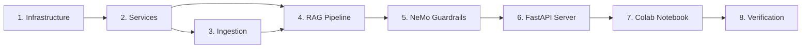

# ROADMAP.md — Mukthi Guru: Execution Strategy

> **If SPEC_DEV.md is the WHAT, this is the HOW.** This document defines the exact sequence, dependencies, and trade-offs for every execution phase. No code is written until this is locked.

---

## Execution Philosophy
- **Radical simplicity**: The simplest robust solution for each phase
- **Zero re-work**: Solve friction in markdown before it hits the compiler
- **Atomic phases**: Each phase is independently testable and commit-worthy
- **Dependency-first**: Build foundations before features

---

## Phase Map



---

## Phase 1: Infrastructure (Foundation)
**Goal**: Zero-to-runnable project skeleton

| Task | Output | Verify |
|------|--------|--------|
| Create `backend/` directory tree | All `__init__.py` files exist | `find backend -name __init__.py` |
| Write `requirements.txt` | Pinned dependencies | `pip install -r requirements.txt` succeeds |
| Write `docker-compose.yml` | Qdrant + Backend on Docker | `docker compose up -d && curl :6333/healthz` |
| Write `.env.example` + `config.py` | Pydantic Settings | `python -c "from app.config import settings"` |
| Update `.gitignore` | Python artifacts excluded | `git status` clean |

**Trade-offs considered**:
- ✅ **Local dev**: Docker Compose (Qdrant + Backend containers, Ollama on host) — chosen for reproducibility
- ✅ **Colab**: Qdrant local mode (no Docker needed) — chosen for zero-infra on Colab
- ✅ Pydantic Settings (type-safe, validation) — chosen over raw os.environ
- ❌ python-decouple — less type safety

**Risk**: None. Pure scaffolding.

---

## Phase 2: Services Layer (Building Blocks)
**Goal**: Each service works independently. No coupling between services.

| Task | Output | Verify |
|------|--------|--------|
| `qdrant_service.py` | init, upsert, search | Unit test: create collection, insert, retrieve |
| `embedding_service.py` | encode + CrossEncoder rerank | Unit test: embed text, rerank pairs |
| `ollama_service.py` | generate, classify, grade, verify | Integration test: Ollama responds |
| `ocr_service.py` | extract text from URL/file | Unit test: OCR on sample image |

**Trade-offs considered**:
- ✅ all-MiniLM-L6-v2 (80MB, CPU) — chosen for low resources
- ❌ BGE-M3 (multilingual, ~2GB model size on disk/RAM; CPU inference viable) — deferred due to resource footprint, not VRAM limitation
- ✅ CrossEncoder ms-marco (90MB, CPU) — chosen for precision
- ❌ ColBERT (multi-vector) — overkill for our corpus size
- ✅ EasyOCR (3-line API, 80+ languages) — chosen for simplicity
- ❌ PaddleOCR (faster) — harder to install on Windows

**Risk**: Ollama may not be installed. Mitigation: health check + clear error messages.

---

## Phase 3: Ingestion Pipeline (The Body)
**Goal**: YouTube URL → indexed knowledge. Image URL → indexed knowledge.

| Task | Output | Verify |
|------|--------|--------|
| `youtube_loader.py` | 3-tier transcript fallback | Test with real YouTube URL |
| `image_loader.py` | URL download + OCR | Test with sample image URL |
| `cleaner.py` | Strip filler/timestamps | Unit test with dirty transcript |
| `raptor.py` | Cluster → summarize → tree | Verify summary quality + Qdrant storage |
| `pipeline.py` | Orchestrator | E2E: URL → chunks in Qdrant |
| ✅ `bulk_ingest_async.py` | Sequential queue stages (Phase 1: Retries/Backfills, Phase 2: New) | Circuit breaker, DLQ, ETA, dual-DB tracking |
| ✅ `extract_transcripts.py` | Batch Apify extraction (359 videos) | `transcripts/_state.json` |
| ✅ `generate_all_skills.py` | Compile 15 technical books into local and global agent skills | Checked in `.agents/skills` and `~/.config/agents/skills` |
| ✅ `telemetry_sink.py` | Async Supabase telemetry sink for queries, responses, and events | Checked database count updates |

**Trade-offs considered**:
- ✅ 3-tier transcript (manual → whisper → auto-captions) — maximum coverage
- ❌ Whisper-only — slower, unnecessary when captions exist
- ✅ RAPTOR 2-level tree (leaves + summaries) — covers specific + thematic
- ❌ RAPTOR 3+ levels — diminishing returns for our corpus size
- ✅ RecursiveCharacterTextSplitter(500, 50) — proven chunk size
- ❌ Semantic chunking — adds complexity, marginal gain

**Risk**: Whisper on CPU is slow (~2x realtime). Mitigation: Use captions first; Whisper is fallback only.

**Current Status** (May 2026):
- 359 videos extracted, 75 ingested (Qdrant + KG), **357 remaining**
- 29 permanently failed (no transcript / deleted videos) — classified in DLQ
- 72 videos need LightRAG KG backfill (`--retry-lightrag-missing`)

**Tech Debt**:
- [ ] Run `--retry-lightrag-missing` sweep for 72 Qdrant-only videos (Deferred per user direction, June 2026)
- [ ] Complete remaining 357-video ingestion run (Deferred per user direction, June 2026)
- [x] Heal 220 poisoned Neo4j entity descriptions via `scripts/ops/heal_neo4j_poison.py` (May 2026)
- [x] Add benchmark cache bypass (`is_benchmark` guard in `main.py`) to prevent score inflation (May 2026)
- [x] Raise `SEMANTIC_CACHE_SIMILARITY` threshold 0.92 → 0.96 (May 2026)
- [x] Fix dead `ContextualChunkingService` — now passes `full_document` at all 3 `_augment_chunks` call sites (May 2026)
- [x] Integrate ekimetrics DCC+BI+RC metrics via `AdaptiveChunkingAdapter` (May 2026)
- [x] **R3**: Graceful shutdown drain — `_INFLIGHT` counter + 30s drain on SIGTERM (May 2026)
- [x] **R4**: Per-node timing in `GraphState.node_timings` — accumulated by `log_metrics` at ms precision (May 2026)
- [x] Build and integrate three codebase graph & memory MCP servers: Graphify, Claude-Mem, and CodeGraph locally/globally (June 2026)
- [x] Resolve Node 25 WASM compiler Zone allocation memory crashes by linking explicitly to Node 22 LTS (June 2026)
- [x] Housekeeping: Prune locked dead git worktrees (agent-*) and delete stale merged local branches to eliminate shell lag (June 2026)
- [x] Consolidate benchmark execution under `backend/benchmarks/` with explicit multi-turn, cache, Self-RAG, CoVe, citation, and category-score reporting (June 2026)
- [x] Expose `/api/chat` evaluation metadata (`faithfulness_score`, `relevancy_score`, `confidence_score`, `verification`, `hallucination_flag`) for production benchmark scoring (June 2026)
- [x] **R5**: Circuit breaker on LLM provider via `tenacity` (Wave 1, completed June 2026)
- [x] **Q1-Q4**: Chunk size evaluation, token budget guard, eval harness (Wave 2, completed June 2026)
- [x] **S3**: Replace Redis coalescer `sleep(0.1)` with `BLPOP`-style blocking wait (Wave 3, completed June 2026)
- [x] **P1**: Persist telemetry to Redis Streams instead of `BackgroundTasks` (Wave 4, completed June 2026)
- [x] Benchmark Recovery: Timeout escalation, CoT strip rules, adversarial_traps queries, and citation denominator filter (June 2026)
- [x] Integrate OpenRouter as primary cloud LLM provider option using Llama free models (June 2026)
- [x] Production Readiness Fixes: lower semantic cache threshold to 0.78, add L1 Redis cache configuration, fix lightweight guardrail LLM bypass, implement real SSE streaming, resolve prompt contradictions, and implement semantic parent/sentence-boundary child splitting with content hash deduplication in ingestion (June 2026)
- [x] Anthropic Gateway Integration: Wire direct `AnthropicGateway` with prompt caching + Citations API, add `--use-batch` to `eval_runner.py` for judge evaluations, and migrate 12 hardcoded P1 thresholds to Settings (June 2026)
- [x] **Production Audit Fixes (2026 Audit Report)**: Cache LettuceDetect results in state, scale context budget dynamically by query tier, implement query rewrite validation fallback to original question, add `confidence_gating_floor` setting, and provide dev docker-compose password fallbacks. (June 2026)


---


## Phase 4: LangGraph RAG (The Brain) — **Critical Path**
**Goal**: 11-layer pipeline produces zero-hallucination, cited answers.

| Task | Output | Verify |
|------|--------|--------|
| `states.py` | GraphState TypedDict | Type checks pass |
| `prompts.py` | All templates with guardrail instructions | Review: each prompt constrains output |
| `meditation.py` | 4-step Serene Mind | Unit test: step progression |
| `nodes.py` — intent_router | Classify DISTRESS/QUERY/CASUAL | Test: "I'm stressed" → DISTRESS |
| `nodes.py` — retrieve + rerank | Top-20 → CrossEncoder → Top-3 | Test: relevant docs scored higher |
| `nodes.py` — grade + rewrite | CRAG loop (3x max) | Test: irrelevant docs trigger rewrite |
| `nodes.py` — extract_hints | Stimulus RAG hint extraction | Test: hints contain key terms |
| `nodes.py` — generate | Answer with citations | Test: response cites sources |
| `nodes.py` — check_faithfulness | Self-RAG output check | Test: fabricated answer → rejected |
| `nodes.py` — verify_answer | CoVe verification questions | Test: subtle error → caught |
| `nodes.py` — decompose_query | Split complex queries | Test: multi-part → sub-queries |
| `graph.py` | Full LangGraph wiring | E2E: question → grounded answer |

**Trade-offs considered**:
- ✅ Stimulus RAG (1 LLM call) — chosen over fine-tuning (hours + GPU)
- ❌ Fine-tuning — higher cost, stale knowledge, hallucination risk
- ✅ CoVe (1 LLM call) — final safety net
- ❌ Full FLARE — needs token-level confidence, complex with Ollama
- ✅ Query decomposition (1 conditional LLM call) — handles "compare X and Y"
- ❌ Always decompose — adds latency for simple queries

**Risk**: Too many LLM calls → exceeds 3s latency.

**Latency Profiling Plan**:
- Sequential stages: Intent → Retrieve → Rerank → Grade → [CRAG loop ×3 max] → Hints → Generate → Faithfulness → CoVe → Guardrails
- Parallelizable: Retrieve + Rerank can overlap; Guardrails input can run concurrently with intent
- **Action**: Run early benchmarks on target hardware (Llama 3.2 on CPU/shared GPU), measure per-stage p95, update targets
- **Target**: p95 < 3s for happy path (no CRAG rewrites); p95 < 8s worst case (3× CRAG). CoVe is skippable if faithfulness passes with high confidence.

---

## Phase 5: NeMo Guardrails (Safety Layer)
**Goal**: Input blocking + output moderation

| Task | Output | Verify |
|------|--------|--------|
| `config/config.yml` | NeMo config with Ollama | Config loads without error |
| `config/topics.co` | Colang flows for blocked topics | "Bitcoin?" → blocked |
| `rails.py` | check_input, check_output | "Kill myself" → blocked + helpline |

**Trade-offs considered**:
- ✅ NeMo Guardrails (Colang DSL) — chosen for production-grade, declarative rules
- ❌ Custom Python checks — fragile, hard to maintain
- ❌ Guardrails AI (guardrails-ai) — heavier, more enterprise-focused

**Risk**: NeMo + Ollama integration may have quirks. Mitigation: Test early, fallback to custom checks if needed.

---

## Phase 6: FastAPI Server (The Interface)
**Goal**: 3 endpoints that connect frontend to backend

| Task | Output | Verify |
|------|--------|--------|
| `main.py` | CORS, 3 routes | `curl /api/health` returns ok |
| `dependencies.py` | Singleton DI | Services initialized once |
| `/api/chat` | Full pipeline | E2E: message → response |
| `/api/ingest` | Background ingestion | URL → chunks in Qdrant |
| `/api/health` | Component status | JSON with all service statuses |

**Risk**: None. Standard FastAPI patterns.

---

## Phase 7: Colab Notebook
**Goal**: One-click setup on Google Colab

| Task | Output | Verify |
|------|--------|--------|
| Cell 1: Install deps | pip install | No errors |
| Cell 2: Mount Drive | Persistence path | Drive accessible |
| Cell 3: Init Qdrant | Local mode on Drive | Collection created |
| Cell 4: Ingestion | Paste URL → process | Chunks in Qdrant |
| Cell 5: Load model | Ollama or Unsloth load | Model responds |
| Cell 6: LangGraph | All nodes | Query works |
| Cell 7: FastAPI + ngrok | Public URL | Frontend can connect |

**Risk**: Colab 12-hour limit. Mitigation: Drive persistence means no re-ingestion needed.

---

## Phase 8: Verification (Ship It)
**Goal**: Prove every SPEC_DEV.md criterion is met

| Test | Method | Expected |
|------|--------|----------|
| Hallucination rate < 1% | 20 test queries | All grounded or fallback (CRAG + Self-RAG + CoVe pipeline) |
| Response time < 3s | Benchmark 50 queries | p95 < 3s |
| Distress detection > 90% | 10 distress + 10 non-distress | ≥ 18/20 correct |
| Safety blocking | 5 harmful prompts | All blocked |
| Citation enforcement | 20 queries | All cite sources |
| Frontend E2E | Custom endpoint → chat | Messages display correctly |

---

## Dependency Graph
```
requirements.txt (no deps)
  └→ config.py (no deps)
      └→ qdrant_service.py (needs Qdrant running)
      └→ embedding_service.py (needs sentence-transformers pip)
      └→ ollama_service.py (needs Ollama running)
      └→ ocr_service.py (needs easyocr pip)
          └→ youtube_loader.py (needs yt-dlp, whisper)
          └→ image_loader.py (needs ocr_service)
          └→ cleaner.py (no deps)
          └→ raptor.py (needs embedding_service, ollama_service)
          └→ pipeline.py (needs all above)
              └→ states.py (no deps)
              └→ prompts.py (no deps)
              └→ meditation.py (no deps)
              └→ nodes.py (needs services + states + prompts)
              └→ graph.py (needs nodes)
                  └→ rails.py (needs NeMo)
                      └→ main.py (needs everything)
                          └→ AskMukthiGuru.ipynb (needs main.py)
```

---

---

## Deferred Items (Enhancement Sprint — Jul 7, 2026)

Items explicitly moved out of scope or blocked during the Enhancement & Scaling sprint:

| Item | Reason | Path Forward |
|------|--------|-------------|
| **Sarvam vLLM self-host** | No GPU available in environment. Entire vLLM server + model download is ~50GB GPU-memory task. | Defer until GPU instance (A100/H100) provisioned. Requires docker-compose GPU support. |
| **GDS (Graph Data Science) plugin for Neo4j** | Only `apoc` + `n10s` loaded. GDS requires separate Neo4j plugin download + license (community edition limitations). | Add to `NEO4J_PLUGINS` once GDS CE works with Neo4j 5.17. Louvain/PageRank stubs already exist in `kg_algorithms.py` — they return degraded results. |
| **n10s SPARQL engine** | n10s 5.x dropped its built-in SPARQL engine entirely. `/api/kg/sparql` is a read-only Cypher passthrough. | Either downgrade to n10s 4.x (incompatible with Neo4j 5.17), or implement custom SPARQL→Cypher translation layer. |
| **OWASP ZAP security scan** | `owasp/zap2docker-stable` Docker pull fails — Docker Hub auth denied via `.docker_clean` DOCKER_CONFIG bypass. | Run ZAP with standard Docker config (`sudo` or non-bypass) or switch to `ghcr.io/zaproxy/zaproxy`. |
| **Manim spiritual visualizations** | Manim requires heavy system dependencies (FFmpeg, Cairo, LaTeX) and is a reference-use tool, not production code. | Add to a `docs/` or `notebooks/` companion repo. Not eligible for main app Docker. |
| **Marketing / CLG content** | Blog posts, case studies, landing page copy. Non-code work. | Create a separate `content/` repo or Notion workspace. |
| **Waitlist strategy** | Pre-launch signup collection — email capture, invite tiers, referral tracking. Not urgent until product-market fit is validated. | Placeholder doc at `docs/marketing_strategy.md`. Requires Stripe/email integration when activated. |
| **Daily Wisdom Newsletter** | Scheduled email automation sending daily teaching excerpts. Requires content curation pipeline, email provider (e.g. Resend, SendGrid), and unsubscribe management. | Defer until ingestion is complete and chat UX is stable. Concept doc in `docs/marketing_strategy.md`. |
| **Full learning paths** (Karma→Dharma→Moksha progression) | Requires pedagogical design + content curation — not an engineering task. | Add as a specification document first; implement as a guided UI layer after Phase E6 chat UX is stable. |
| **OWL/RDF full roundtrip** (RDF→Neo4j→RDF) | n10s export works (10.5MB TTL, 7,481 nodes). Full roundtrip (import→query→re-export) needs more testing. | Add SPARQL→Cypher query bridge and verify n10s import preserves all node properties. |
| **n10s inference / schema reasoning** | `n10s.schema.check` and `n10s.inference.schemaInference` were removed in n10s 5.x. | No replacement available. If inference needed, consider a custom Python reasoner over the TTL export. |

## Personal KG Visualizer (Jul 8, 2026)
- [x] Create `seed_personal_kg.py` — 40 ontology concepts (Teachers, Concepts, Practices) with idempotent MERGE
- [x] Backend `GET /api/memory/knowledge-graph` with auth fallback (authenticated → full graph, unauthenticated → ontology only)
- [x] Frontend `MemoryManager.tsx` SVG graph visualizer — circular layout, pan/zoom, dual list/graph toggle
- [x] `memoryApi.ts` `getKnowledgeGraph()` — always sends request, auth header optional
- [x] 435 tests pass (297+32+106, 1 pre-existing failure)
- [x] All services running: backend:8000, frontend:80, Neo4j:7687, Qdrant, Redis, Jaeger, Prometheus, Grafana

## Technical Debt (Remaining from Sprint)

- **BM25 still logs "0 results" for 2/12 queries**: Expected — BM25 is keyword-based; queries without overlapping keywords naturally return 0. Not a bug. Follow-up: consider hybrid BM25+vector search fallback.
- **q3 and q8 slow (92s, 130s)**: Complex RAG with full citation enrichment. These are correct now (200, not 500) but slow. Consider reducing LLM reasoning_effort for these paths.
- **Citations schema in pipeline cache**: Pipeline-level cache (cache_stage.py) short-circuits correctly. In-graph cache (retrieval.py:723) doesn't short-circuit generation. Pipeline cache handles the common case.
- **Embedding cache stale after batch encode change**: Phase B moved to `encode_batch` for primary queries but expansion queries still encode individually. Acceptable — expansion runs in parallel with LLM call, so encode time is hidden.
- **Security checklist 12/22 done**: Items 13-22 (WAF, rate limiting, DDoS, audit logging, backup verification, incident response runbook) require infra/platform decisions beyond code changes.

---

## Timeline Estimate
| Phase | Estimated Effort | Cumulative |
|-------|-----------------|------------|
| 1. Infrastructure | 30 min | 30 min |
| 2. Services | 1 hour | 1.5 hours |
| 3. Ingestion | 1.5 hours | 3 hours |
| 4. RAG Pipeline | 2 hours | 5 hours |
| 5. Guardrails | 30 min | 5.5 hours |
| 6. FastAPI | 30 min | 6 hours |
| 7. Colab | 1 hour | 7 hours |
| 8. Verification | 1 hour | **8 hours total** |

> **3 months of engineering compressed into 1 day of high-leverage execution.**
