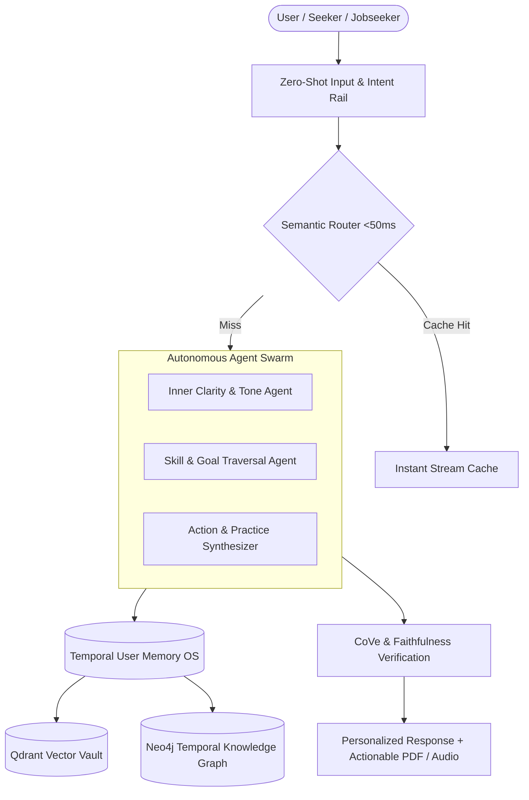

# Ruthless Platform Audit & Strategic Blueprint: The One-Shot Solution

> **Mission**: Transform AskMukthiguru from a RAG-based AI conversational companion into an unbeatable, memory-first, temporal-graph powered **One-Shot Solution** for life guidance, career clarity, skill progression, and inner transformation.

---

## 1. Ruthless Architecture Audit: Current vs. World-Class (2026 Standards)

| Dimension | Current Implementation | 2026 World-Class Benchmark | Ruthless Gap & Upgrade |
|---|---|---|---|
| **Retrieval Architecture** | 12-layer RAG (Dense Qdrant + LightRAG Neo4j) | **Agentic Temporal GraphRAG** | Vector search loses context across time. Upgrade to **Temporal Knowledge Graphs** (`valid_at`/`invalid_at` edges) to track how user goals, skills, and emotional states evolve over time without data corruption. |
| **User Memory Layer** | Qdrant `second_brain_vault` + 3-tier TTL (Redis/Postgres) | **3-Scope Memory OS (Hot/Warm/Cold + Graphiti)** | Current memory is text-chunk vectors. Upgrade to **Entity-Relation User Vault** (storing explicit skills, career goals, emotional triggers, and historical decisions as graph edges). |
| **Agent Autonomy** | Fixed LangGraph sequential pipeline | **Autonomous Tool-Calling Multi-Agent Swarm** | Transition from fixed chain node execution to **Dynamic Tool Execution** (e.g. resume/skill gap evaluation, real-time interview simulator, custom practice audio synthesizer). |
| **Persona & Tone Adaptation** | 3-tier classification (Seeker / Practitioner / Advanced) | **Real-Time Psychometric & State Adaptation** | Dynamic state adaptation: detect user cognitive load, anxiety level, and domain context in real-time; adapt response length, vocabulary, and actionable steps instantly. |
| **Latency & Performance** | ~1.5s - 3.0s response latency | **Sub-500ms Streaming & Sub-50ms Cache** | Expand **Semantic Query Caching** with local ONNX embeddings to serve frequent intent patterns in <50ms without touching the LLM. |

---

## 2. Five Pillars of the "One-Shot" Solution



### Pillar 1: Temporal Knowledge Graph & Memory OS (Neo4j + Qdrant)
- **Problem**: Static vector RAG forgets historical context and cannot resolve state changes (e.g., "I learned Python last month, now I want to switch to Go").
- **Ruthless Fix**: Implement **Temporal Edges** in Neo4j (`(User)-[:HAS_SKILL {level: 'intermediate', updated_at: '2026-07-23'}]->(Skill)`). Automatically update or invalidate outdated node connections as users progress.

### Pillar 2: Agentic Multi-Tool Execution Engine
- **Problem**: Current engine only returns textual answers. Users want *actions* and *deliverables*.
- **Ruthless Fix**: Equipping the platform with actionable execution tools:
  - **Skill & Gap Diagnostic Tool**: Analyzes user background vs. target goals, outputs radar maps.
  - **Interactive Mock Simulator**: Real-time voice/text conversational evaluator with instant feedback.
  - **One-Click Deliverable Generator**: Generates customized Typst/PDF action plans, daily routines, and audio guided practices.

### Pillar 3: Ultra-Low Latency & High-Throughput Pipeline
- **Problem**: Long RAG chains (12 layers) cause initial token latency.
- **Ruthless Fix**:
  - **Zero-LLM Fast Path**: Bypasses full RAG for standard queries using **Semantic Router** (sub-50ms response).
  - **Streaming Reranker Engine**: Use lightweight CPU-optimized ONNX rerankers (`mmarco-mMiniLMv2-L12`) to keep cross-encoding latency under 15ms per chunk.

### Pillar 4: Deep Personalization & Behavioral Adaptation
- **Problem**: One-size-fits-all responses feel generic and detached.
- **Ruthless Fix**: Combine **User Familiarity Classification** (`Seeker`, `Practitioner`, `Advanced`) with **Real-time Distress & State Detection** (`Serene Mind`). The AI adjusts tone, depth, and actionable rigor dynamically based on current user emotional state.

### Pillar 5: Production Rigor & Zero-Regression Quality Gate
- **Problem**: Changes risk breaking edge cases or causing hallucination regressions.
- **Ruthless Fix**: Continuous evaluation gate (`make eval`) enforcing:
  - **Overall Quality Score**: $\ge 95\%$
  - **Category Benchmark Score**: $\ge 90\%$
  - **Zero Hallucination Tolerance** on verified doctrine/factual context.

---

## 3. High-Impact Execution Roadmap

### Phase 1: Temporal Memory & Entity Vault (Immediate / Week 1)
- [ ] Upgrade `second_brain_vault` in Qdrant with structured entity payloads (skills, goals, emotional state).
- [ ] Add temporal timestamps (`created_at`, `valid_until`) to Neo4j graph nodes and relationship edges.
- [ ] Add `DELETE /api/memory/reflections` and individual entity forget capability (`POST /api/memory/forget`).

### Phase 2: Autonomous Tool Calling & Action Engine (Week 2)
- [ ] Implement `ActionEngine` tool interface for generating downloadable action plans and study/meditation routines.
- [ ] Integrate Typst/PDF export service for formatted single-page progress reports.
- [ ] Implement multi-hop intent routing: automatically trigger tool execution when user asks for structured guidance.

### Phase 3: Real-Time Audio & Low-Latency Fast Path (Week 3)
- [ ] Upgrade `SemanticRouter` ONNX cache for sub-50ms instant response on top 500 query intents.
- [ ] Add WebRTC / WebSocket low-latency audio streaming for real-time conversational practice.

### Phase 4: Production Evaluation & Self-Healing (Week 4)
- [ ] Expand automated benchmark suite (`ruthless_benchmark.py`) with 100+ multi-turn edge case scenarios.
- [ ] Deploy automated telemetry anomaly detection for real-time hallucination rate monitoring.

---

## 4. Verification & Quality Benchmarks

### Automated Verification Targets
```bash
# 1. Run core test suite
make test

# 2. Run production evaluation gate (>95% score target)
make eval

# 3. Verify graph node consistency in Neo4j
curl -s http://localhost:7474
```

### Success Metrics
- **Response Latency**: $<50\text{ms}$ (Cached Fast Path) / $<1.2\text{s}$ (Full Agentic RAG).
- **Benchmark Score**: $\ge 95\%$ overall eval quality.
- **Memory Accuracy**: $100\%$ precision on user core vault entity retrieval across sessions.
