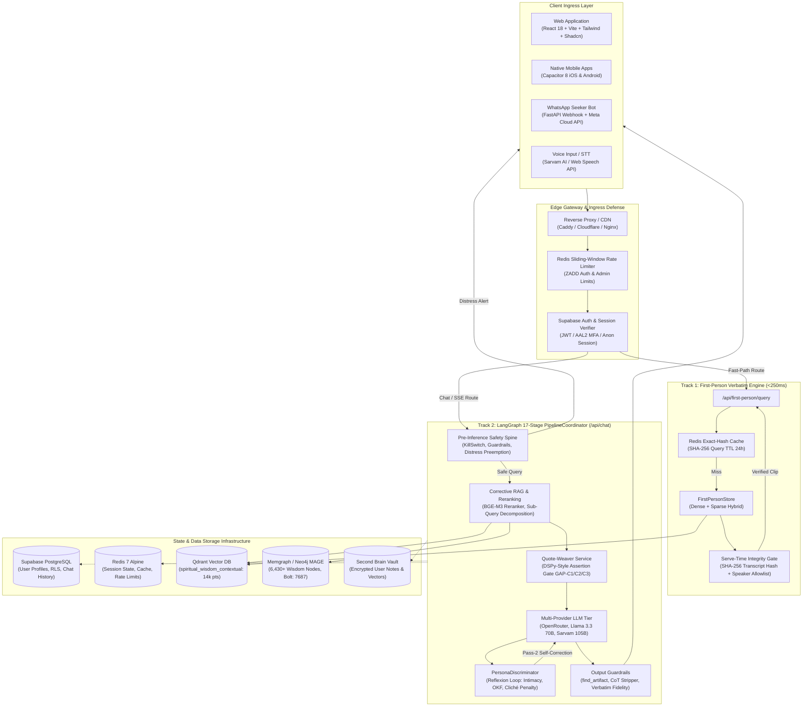
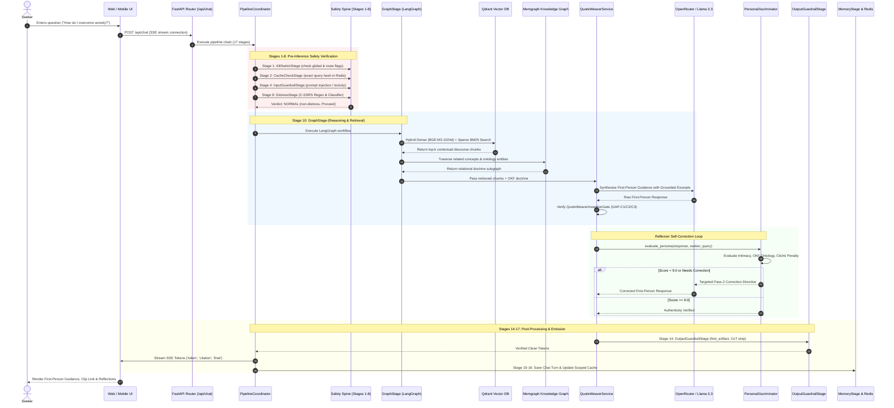
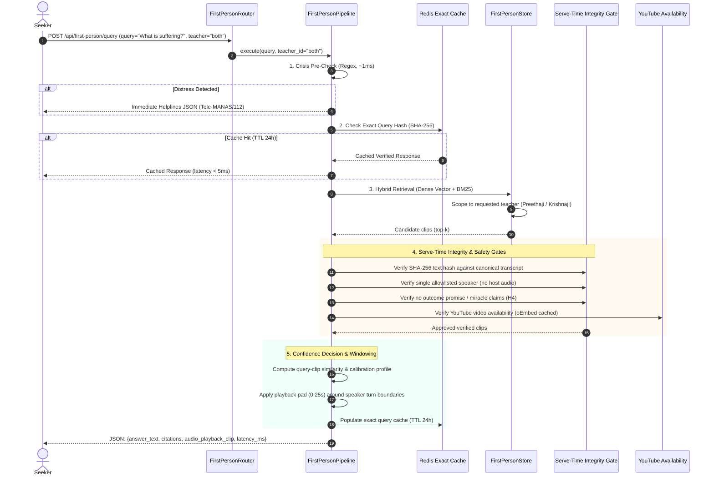
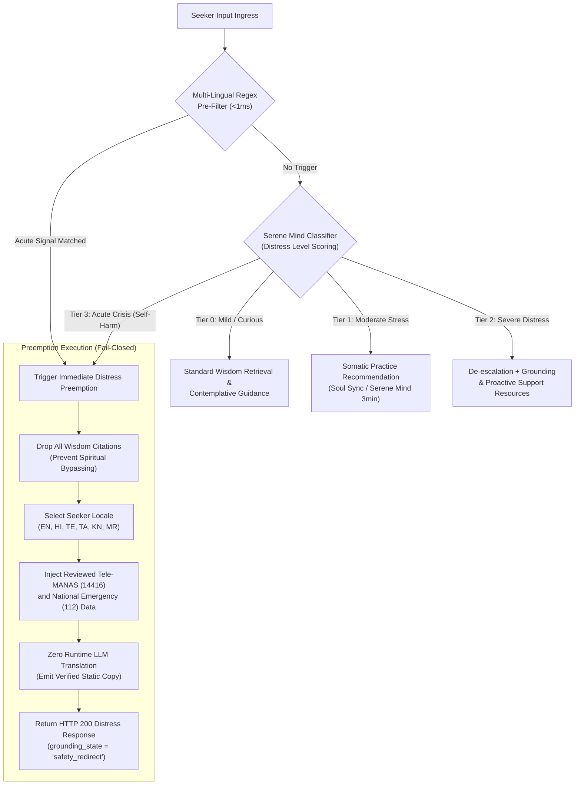
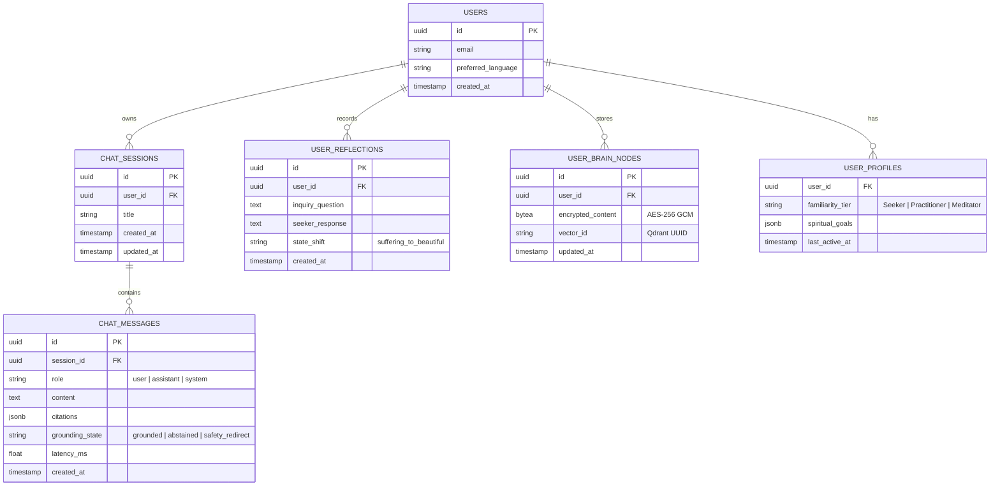

# AskMukthiGuru — End-to-End System Architecture (HLD & LLD)

> **Document Version**: 2.0.0 (Production Architecture Formalization)  
> **Target Audience**: Core Engineers, System Architects, Clinical Safety Officers, Security Reviewers  
> **Status**: APPROVED ARCHITECTURE BASELINE (2026-10-10)  
> **Governing Documents**: `CLAUDE.md`, `AGENTS.md`, `lessons.md`, `docs/safety/CLINICAL_SAFETY_DOSSIER.md`, `docs/architecture/first-person-path-to-prod.md`

---

## 1. Executive Summary & Core Architectural Invariants

AskMukthiGuru is an AI-powered conversational wisdom platform designed to serve the authentic teachings of **Sri Krishnaji** and **Sri Preethaji** (Ekam / O&O Academy). Unlike conventional chatbots that summarize spiritual philosophies from a detached, third-person perspective ("According to Sri Krishnaji..."), AskMukthiGuru delivers guidance in the intimate, compassionate **First-Person Voice** ("I invite you to see...", "When I speak of the Beautiful State...") while enforcing verifiable, zero-hallucination grounding in authentic recorded video discourses and curated ontological doctrine.

```
                                  ┌───────────────────────────┐
                                  │   Seeker Query Ingress    │
                                  └─────────────┬─────────────┘
                                                │
                                                ▼
                                  ┌───────────────────────────┐
                                  │   Pre-Inference Safety    │
                                  │ (KillSwitch, C-SSRS, Pre) │
                                  └─────────────┬─────────────┘
                                                │
                        ┌───────────────────────┴───────────────────────┐
                        ▼                                               ▼
         ┌─────────────────────────────┐                 ┌─────────────────────────────┐
         │     Fast-Path Verbatim      │                 │     Deep LangGraph RAG      │
         │  (/api/first-person/query)  │                 │         (/api/chat)         │
         │  p95 < 250ms Verbatim Clip  │                 │  Streaming Synthesis (SSE)  │
         └──────────────┬──────────────┘                 └──────────────┬──────────────┘
                        │                                               │
                        └───────────────────────┬───────────────────────┘
                                                ▼
                                  ┌───────────────────────────┐
                                  │   Post-Inference Guard    │
                                  │ (Verbatim Gate, CoT Strip)│
                                  └─────────────┬─────────────┘
                                                │
                                                ▼
                                  ┌───────────────────────────┐
                                  │ Multi-Channel Presentation│
                                  │ (Web, iOS, Android, WA)   │
                                  └───────────────────────────┘
```

### The 5 Binding System Invariants
1. **Zero-Hallucination Teacher Attribution**:
   Any statement attributed to Sri Krishnaji or Sri Preethaji in first-person voice must be an exact substring of verified transcript points or curated Ontological Knowledge Framework (OKF) doctrine. Fabricated quotes or persona impersonation without source grounding are blocked at both compile and serve time (`services/quote_weaver.py`).
2. **Dual-Response Topology**:
   - **Fast-Path Route (`/api/first-person/query`)**: Returns exact, unedited video discourse clips with sub-second latency (local p95 ~210ms) and exact timestamp boundaries.
   - **Deep Synthesis Route (`/api/chat`)**: LangGraph multi-stage pipeline streaming compassionate first-person pastoral guidance with embedded quote weaving, reflection inquiry, and meditation assignments.
3. **Fail-Closed Crisis Preemption (Manus H3, H6, H10, H11)**:
   Any seeker query manifesting acute emotional distress, self-harm ideation, or psychiatric emergency triggers instant preemption at Stage 8 (`DistressStage` / `SereneMindEngine`). It returns static, clinically reviewed Tele-MANAS (`14416`) and Emergency (`112`) guidance in 6 Indic languages with zero runtime LLM generation and zero citations.
4. **Outcome Promise Quarantine (Hard Stop H4)**:
   Discourse excerpts containing literal miracle guarantees or miraculous healing claims ("your problems will melt like ice in the sun") are quarantined at ingestion and serve boundaries (`_OUTCOME_PROMISE_CLIP_RE`, `BLOCKED_PROMISE_POINT_IDS`).
5. **Multi-Lingual Indic Parity**:
   Full semantic support across 6 priority languages (English, Hindi, Telugu, Tamil, Kannada, Marathi) with native script responses, localized crisis helplines, and culturally tuned tone adaptation.

---

## 2. High-Level Design (HLD)

### 2.1 End-to-End System Context & Topology



### 2.2 Architectural Layers & Component Responsibilities

| Layer | Primary Components | Key Functions & Invariants |
|---|---|---|
| **1. Client & Ingress** | `src/` (Web), `ios/` & `android/` (Mobile), `whatsapp_bot/` (WhatsApp) | Unified reactive UX, streaming SSE rendering, Web Speech audio input, asynchronous WhatsApp webhook handling (<15s ack). |
| **2. Edge & Security** | `security_utils.py`, `auth_service.py`, `limiter.py` | AAL2 / MFA verification, token replay prevention, Redis-backed sliding-window rate limiting, anonymous session signing. |
| **3. Safety Spine** | `kill_switch_stage.py`, `input_guardrail.py`, `distress_stage.py` | Fail-closed kill switches, prompt-injection defense, C-SSRS multi-lingual crisis triage, zero-latency emergency routing. |
| **4. Fast-Path Engine** | `first_person_pipeline.py`, `first_person_store.py` | Sub-second verbatim discourse clip serving, exact-query caching, clip boundary sanitization, YouTube playback windowing. |
| **5. Graph Reasoning** | `pipeline_coordinator.py`, `retrieval.py`, `reranking.py` | 17-stage LangGraph workflow, hybrid dense/sparse retrieval, CRAG context sufficiency check, doctrine query anchoring. |
| **6. First-Person Weaving**| `quote_weaver.py`, `persona_discriminator.py` | First-person flowing prose synthesis, assertion-gated quote fidelity, reflection question generation, automated reflexion judge. |
| **7. Persistence & Memory**| `redis_adapter.py`, `vault_index.py`, `second_brain/` | 3-tiered memory retention (ephemeral Redis, transient chat logs, AES-256 encrypted Second Brain vault), GDPR right-to-forget. |

---

## 3. Low-Level Design (LLD)

### 3.1 Unified Chat Request Lifecycle Sequence (Track 2: Deep Path)



---

### 3.2 First-Person Verbatim Teaching Route Sequence (Track 1: Fast Path)

The First-Person verbatim route (`/api/first-person/query`) provides near-instantaneous access to authentic video discourse clips. It completely bypasses generative LLMs to guarantee 100% faithful reproduction of recorded teachings.



---

### 3.3 Clinical Safety & Distress Preemption Workflow (C-SSRS Triage)



---

## 4. Component Deep Dive

### 4.1 First-Person Sacred Wisdom Engine
- **`FirstPersonPipeline` (`backend/services/first_person_pipeline.py`)**:
  Orchestrates verbatim clip serving with zero generative drift. Operates in two confidence states:
  - *Calibrated Confident*: Returns the discourse clip under the label "Their answer" when cosine confidence meets the calibrated empirical threshold.
  - *Uncalibrated / Weak Match*: Returns the closest verbatim clip honestly labeled "Closest teaching, related to your question", preventing false claims of definitive answers.
- **`QuoteWeaverService` (`backend/services/quote_weaver.py`)**:
  Transforms discrete transcript chunks and OKF doctrine into an intimate, flowing first-person spoken teaching. Implements the **DSPy-style Assertion Gate**:
  - `GAP-C1`: Validates that video timestamps (`t=`) lie strictly within the physical video duration ($\le 12\text{ hours}$).
  - `GAP-C2`: Enforces that any sentence attributing speech to a teacher is verbatim.
  - `GAP-C3`: Forbids arbitrary snippet truncation (`clips[:2]`), ensuring complete context.
  - Fallback: Deterministic flowing template triggered if the synthesis LLM fails or violates assertions.
- **`PersonaDiscriminator` (`backend/services/guru_brain/persona_discriminator.py`)**:
  Reflexion judge evaluating generated answers across three axes (0–10 scale):
  1. *Direct Intimacy*: Warm, face-to-face, personal engagement without boilerplate preamble.
  2. *OKF Ontology Grounding*: Proper grounding in Inner World vs Outer World, Beautiful State vs Suffering State, and Witnessing.
  3. *Cliché Penalty*: Zero tolerance for robotic AI boilerplate ("As an AI...", "I hope this helps..."), script markers ("Sri Krishnaji:"), or third-person detachment.

### 4.2 Serene Mind Clinical Engine & Distress Stage
- Aligned with the **Columbia-Suicide Severity Rating Scale (C-SSRS)**.
- Operates across 6 Indic languages using deterministic keyword matrices (`_CRISIS_KEYWORDS` covering Devanagari, Telugu, Tamil, Kannada, and Malayalam scripts).
- Preserves the **Clinical Protocol Sign-Off** (`docs/safety/FACULTY_CLINICIAN_REVIEW_SIGN_OFF.md`): clinical preemption responses are statically verified and never generated by live LLMs.

### 4.3 17-Stage Pipeline Coordinator
Defined in `backend/app/pipeline/stages/pipeline_builder.py`:
1. `KillSwitchStage`: Global and route-level emergency stop.
2. `CacheCheckStage`: Exact-match query hash cache in Redis.
3. `RequestStateStage`: Tenant, session, and rate-limit tracking.
4. `InputGuardrailStage`: Prompt injection and toxic content filtering.
5. `CircuitBreakerStage`: Provider latency/error tripwire.
6. `DoctrineCacheStage`: Pre-compiled doctrine response matching.
7. `CasualShortCircuitStage`: Zero-latency greeting / small-talk responses.
8. `DistressStage`: C-SSRS crisis detection and preemption.
9. `BoundedComparisonShortCircuitStage`: Controlled philosophical comparative answers.
10. `GraphStage`: LangGraph entry router (dispatches to `first_person` or general RAG).
11. `MeditationGenStage`: Tailored contemplation and breathing guidance.
12. `TranslationStage`: Multilingual translation into target Indic locale.
13. `ToneAdapterStage`: Tone tuning based on seeker familiarity level.
14. `OutputGuardrailStage`: Artifact detection, CoT strip, and verbatim verification.
15. `MemoryStage`: 3-tier memory persistence and Second Brain sync.
16. `CacheUpdateStage`: Writes safe responses to Redis cache.
17. `ResultAssemblyStage`: Formats final SSE / JSON payload.

---

## 5. Data Models & Storage Architecture

### 5.1 Relational Schema (PostgreSQL)



### 5.2 Vector & Graph Store Architecture

1. **Qdrant Vector Database**:
   - `spiritual_wisdom_contextual` (14,033 points):
     - Vectors: 1024-dimensional dense vectors (`BAAI/bge-m3` via ONNX Runtime).
     - Payload: `chunk_text`, `video_id`, `start_time_s`, `end_time_s`, `speaker` ("Sri Krishnaji" | "Sri Preethaji"), `transcript_sha256`, `context_header`.
   - `second_brain_vault`:
     - Isolated user memory vectors with payload-level encryption; vectors searchable only within `user_id` scope.
2. **Memgraph / Neo4j Knowledge Graph (Bolt :7687)**:
   - 6,430+ nodes (`Concept`, `Teaching`, `Teacher`, `Practice`, `State`).
   - 4,188+ relationships (`TEACHES`, `TRANSFORMS`, `ADDRESSES`, `PRACTICES`).
   - Powers LightRAG dual-level entity and relational traversal.

---

## 6. Observability, Reliability & Security

### 6.1 Telemetry & Distributed Tracing
- **OpenTelemetry & Jaeger**: Distributed traces span from HTTP ingress down to Qdrant vector search and OpenRouter LLM completions.
- **Prometheus Metrics**:
  - `first_person_requests_total{status, teacher}`
  - `first_person_latency_seconds_bucket`
  - `distress_preemption_total{script, c_ssrs_level}`
  - `quote_weaver_assertions_failed_total{assertion_type}`

### 6.2 Zero-SPOF Resilience & Graceful Degradation
- **Redis Degradation**: If Redis fails, rate limiting degrades to an in-memory TTL limiter; caching degrades to live retrieval without dropping requests.
- **LLM Circuit Breaker**: If OpenRouter fails or reaches rate limits, the pipeline cascades through secondary providers (NIM / Sarvam AI) before safely falling back to curated OKF doctrine templates.
- **YouTube Availability Caching**: Video URLs are validated via a keyless oEmbed check with a 600ms timeout; failures fail-open to avoid stalling responses.

---

*Authored by the MukthiGuru Architecture & Core Engineering Team.*
