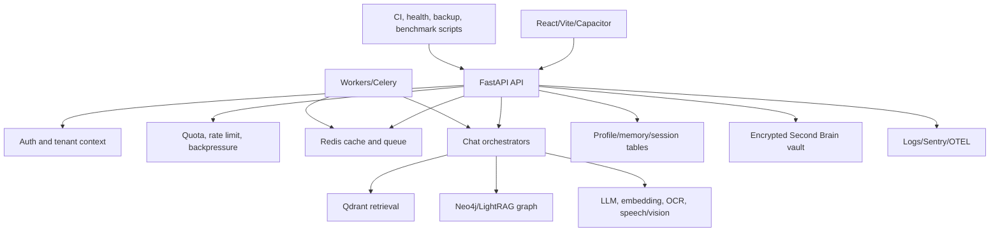

# Dependency Map

| Dependency | Used by | Failure behavior to verify |
|---|---|---|
| Redis | Rate limits, exact/semantic cache, job queue | Bounded fallback, no global flush, queue durability and restart. |
| Qdrant | Dense/sparse retrieval and semantic cache | Empty/error-safe response, tenant/corpus filter, valid evaluation. |
| Neo4j/LightRAG | Graph context and graph tiers | Optional/degraded behavior and connection recovery. |
| Supabase | Auth, profile memory, summaries, support-related state | RLS/BOLA, migration compatibility, transaction/partial-write behavior. |
| LLM gateways | Chat generation, verification, fallback | Timeout, retry, rate-limit, malformed response, token/cost limits. |
| Embedding/OCR/model services | Retrieval ingestion and uploads | Resource limits, retries, provider unavailability, cost telemetry. |
| Sentry/OTEL/Jaeger | Error reporting and distributed traces | Non-blocking exporter failure, redaction, alerting, trace continuity. |

The most important dependency ordering is identity and admission before user state, retrieval/graph/providers inside bounded orchestration, and persistence/telemetry after safe response shaping. The current release cannot claim that all edges work in a deployed topology because several external services were unavailable to the local test environment.
