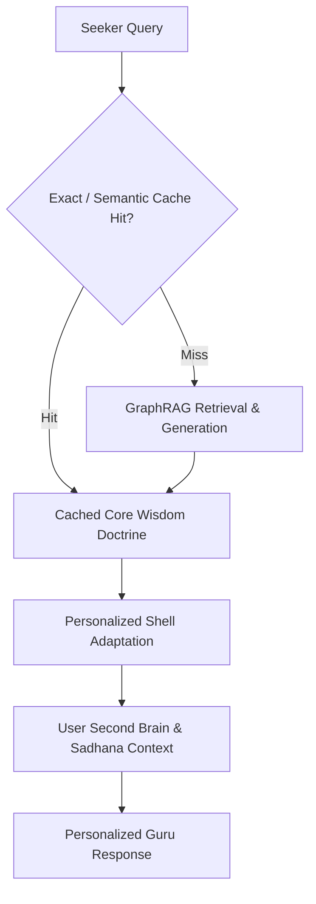

# AskMukthiGuru Strategic Moat Architecture

## 1. Cacheable-Core vs. Personalized-Shell Split

To achieve sub-500ms p95 response latencies while retaining deep seeker personalization:
- **Cacheable Core (Tier-1 Pure Wisdom)**: The foundational spiritual answer derived from the 89k+ chunk Krishnaji/Preethaji corpus is deterministic and tenant-agnostic. Queries matching existing semantic clusters hit the ONNX semantic cache (cosine similarity $\ge 0.96$) directly, consuming 0 LLM tokens.
- **Personalized Shell (Tier-2 Dynamic Envelope)**: User-specific framing (greeting seeker by name, acknowledging recent reflections from the Second Brain vault, adapting tone for Seeker vs. Practitioner vs. Advanced Meditator) is rendered as a lightweight client or edge template overlay around the cached core doctrine.

---

## 2. Retrieval-Time Personalization Ranking

Candidate chunks retrieved from Qdrant dense vector index and BM25 sparse index undergo dynamic score re-weighting:

$$\text{FinalScore}(c) = \alpha \cdot \text{DenseScore}(c) + \beta \cdot \text{BM25Score}(c) + \gamma \cdot \text{GraphRel}(c) + \delta \cdot \text{UserAffinity}(c)$$

Where:
- $\text{GraphRel}(c)$: Relational path density in Neo4j connecting query entities to chunk doctrine.
- $\text{UserAffinity}(c)$: Dot product between the chunk topic embeddings and the user's recent reflection history from the Second Brain vault.

---

## 3. Structured OKF Knowledge Graph Edge Schema

The Ontological Knowledge Framework (OKF) establishes strong ontological typing for Ekam teachings:

| Subject Entity | Edge Type | Object Entity | Description |
| :--- | :--- | :--- | :--- |
| `Beautiful State` | `TRANSCENDS` | `Suffering State` | Movement from self-centric fear to connected presence |
| `Soul Sync` | `PRACTICE_FOR` | `Sankalpa Realization` | 8-step meditation for intention manifestation |
| `Inner Conflict` | `ROOT_CAUSE_OF` | `Suffering State` | Division of consciousness into idealized vs actual self |
| `Deeksha` | `CATALYZES` | `Neurobiological Shift` | Transfer of divine energy to activate calm brainwave states |
| `Four Sacred Secrets` | `CONTAINS` | `Spiritual Principles` | Four core pillars for spiritual fulfillment and freedom |

---

## 4. Citation N-Gram Verification Protocol

To prevent hallucinated attributions:
1. When the generation engine produces an inline citation `[Source: <Discourse Title>]`, the post-generation verification stage extracts verbatim phrases within double quotes.
2. An 8-word continuous n-gram match check is executed against the raw text of the referenced transcript.
3. If the quote does not exist in the source transcript, the quote is converted into an honest summary or the citation score is penalized to prevent false attribution.
