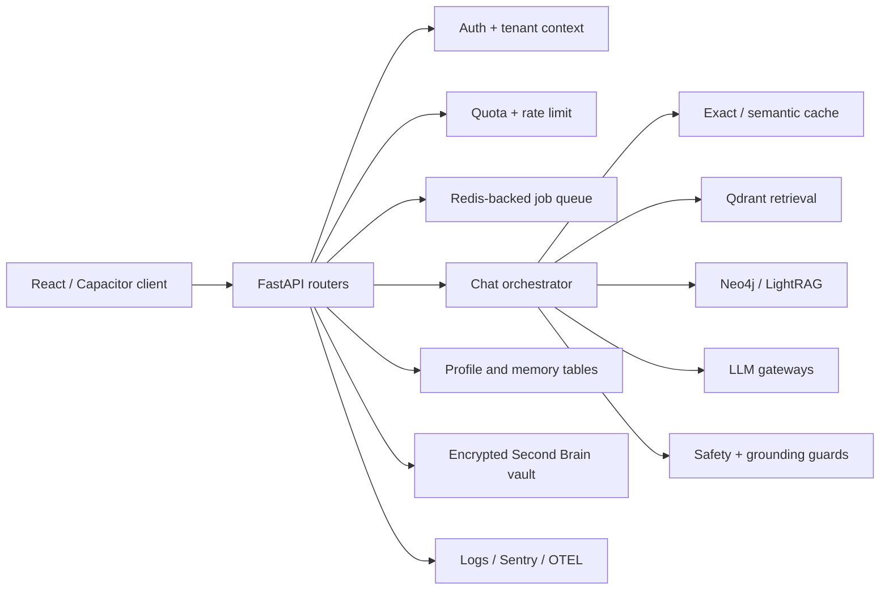

# Architecture

AskMukthiGuru is a React/Vite/TypeScript client with Capacitor packaging and a FastAPI/Python backend. The API composes identity, quotas, retrieval, graph context, generation, safety, memory, queues, and telemetry. Source-level controls include tenant/corpus filters, owner-scoped jobs, bounded admission, and explicit health/readiness state.

| Boundary | Control observed | Verification status |
|---|---|---|
| Identity to resource | Auth dependencies, anonymous-session handling, owner-scoped jobs | Strong targeted tests; live cross-user integration not proven. |
| Retrieval to tenant/corpus | Mandatory Qdrant tenant and corpus filters | Source and targeted tests pass; quality corpus contract unavailable. |
| Browser to backend | CORS, allowlisted SSE metadata, typed clients | Focused CORS/observability tests pass. |
| User input to provider | Validation, uploads, prompt routing, guardrails, provider budgets | Targeted safety tests pass; provider-failure matrix incomplete. |
| Async admission to completion | HTTP 202 queue contract, polling, cancellation | Queue-focused tests pass; live worker recovery not proven. |
| Data stores to deletion/recovery | Memory/vault APIs, retention, backup utilities | Restore drill and cross-store deletion proof incomplete. |

Profile Memory and My Reflections are separate products in the current architecture. Profile Memory reads Supabase-native memory/core-memory/session-summary data, while My Reflections reads the encrypted backend vault. The UI now explains this distinction when vault initialization fails and links to Profile Memory rather than presenting an ambiguous global outage.

The architecture should not be declared scalable or production-ready until critical runtime artifacts, provider dependencies, worker topology, recovery procedures, and a matching retrieval evaluation corpus are provisioned in a disposable release-like environment.
